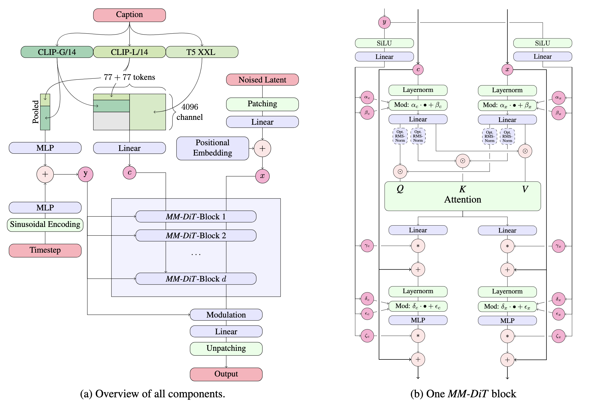
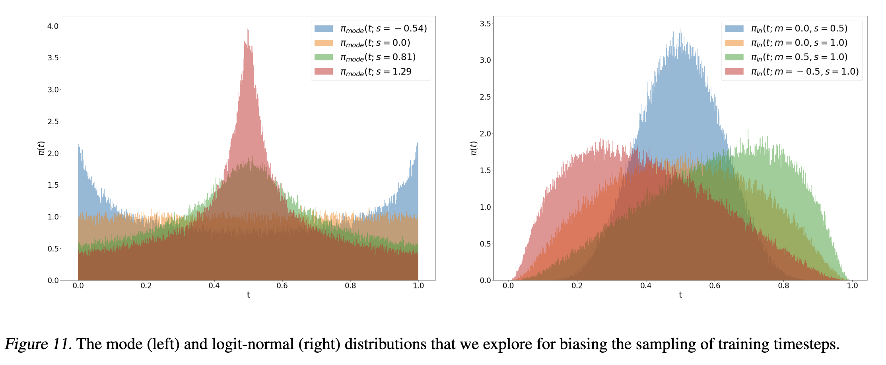

## Stable Diffusion系列

详细描述stable diffusion各个版本的模型以及其区别

|  | SD 1.5 | SD 2.1 | SDXL | SD3 | FLUX-1.0 |
| --- | --- | --- | --- | --- | --- |
| 模型架构 | UNet | UNet | UNet(Base+Refiner) | MM-DiT | MM-DiT |
| Text-Encoder | CLIP ViT-L/14 | CLIP ViT-H/14 | CLIP ViT-L/14 + OpenCLIP ViT-bigG/14 | CLIP ViT-L/14 + OpenCLIP ViT-bigG/14 + T5-XXL | CLIP ViT-L/14 + T5-XXL |
| VAE compression ratio | 8 | 8 | 8 | 8 | 8 |
| 训练目标 | Epsilon-prediction | Epsilon-prediction(SD2.1-base)/ v-prediction(SD2.1-v) | Epsilon-prediction | Rectified Flow | Rectified Flow |

**Stable Diffusion中为什么Context Embedding用来生成K和V，Latent Feature用来生成Q？**

因为在Stable Diffusion中，主要的目的是想把文本信息注入到图像信息中里，所以用图片token对文本信息做 Attention实现逐步的文本特征提取和耦合。

**CFG guidance scale的作用**

**guidance_scale代表CFG（Classifier-free guidance）的权重**，当设置的**guidance_scale越大时，文本的控制力会越强，SD模型生成的图像会和输入文本更一致**。通常guidance_scale可以设置在7-8.5之间，就会有不错的生成效果。**如果使用非常大的guidance_scale值（比如11-12），生成的图像可能会过饱和，同时多样性会降低**。

**Stable Diffusion中的Negative prompt中的作用**

Negative prompt对应无条件扩散模型的文本输入，在训练时设置为空字符串，在推理时设置为我们不想要生成的内容，改善图像生成效果。

**SDXL的架构与SD2.1的区别**

SDXL是一个两阶段的级联扩散模型，包括base模型和refiner模型，其中base模型与SD2.1基本一致，refiner模型对base模型生成的图像latent继续进行优化，提升图像质量

**MM-DiT**



SD2和SD1系列的模型都是用Cross-Attention的形式将文本特征和图像特征结合（文本特征作为keys和values），MM-DiT对文本token和图像latent token分别设置了两套独立的权重参数（文本和图像属于不同的模态），并且在attention计算之前拼接（Concat）在一起，也就相当于用两个独立的Transformer对不同模态的特征进行处理。

Positional Embedding采用Sine-Cosine Encoding

y包括Timestep信息和CLIP pooled embedding（全局语义信息），作为额外的条件信息，通过adaLN-Zero的方式注入MM-DiT中

**SD3中的采样方法**

SD3不再使用DDPM，而是使用Rectified Flow作为采样方法

$$
x_t=(1-t)x_0+t\epsilon
$$

以直线的形式连接噪声和真实数据之间的分布

额外的，SD3指出原始的Rectified Flow的时间步在[0,1]上均匀采样，但是不同时间步的任务难度是不一样的：**刚开始和快到终点的路线很好学，而路线的中间处比较难学**。SD3主要设计了两种方法：Model Sampling with Heavy Tails 和 Logit-Normal Sampling。其中Logit-Normal Sampling的主要问题在于对于t=0和t=1的情况基本采样不到，对性能可能会有一定的影响。



**SD3中的DPO和SDXL中的RLHF**

DPO（Direct Preference Optimization，直接偏好优化）是SD3采用的一种更高效的对齐技术。

**与SDXL使用的RLHF技术（Reinforcement Learning from Human Feedback，基于人类反馈的强化学习）相比，DPO技术的优势是无需单独训练一个Reward模型，而是直接基于成对的比较数据进行微调训练。** 具体来说，我们首先收集人类偏好数据（固定提示词生成的图片中选出人类最喜欢的那个）；然后设计一个损失函数，使模型倾向于生成更符合人类偏好的输出。通过最小化这个损失函数，直接微调模型参数。DPO避免了强化学习中的试错过程，训练更稳定，效率更高。

RLHF是SDXL中采用的一种对齐技术，它需要先训练一个独立的Reward模型来评估生成图像的质量，然后使用强化学习算法（如PPO）来优化扩散模型，使其生成更符合人类偏好的图像。虽然RLHF理论上可以获得更好的对齐效果，但训练过程复杂，需要大量计算资源，且训练不稳定。相比之下，DPO通过直接优化偏好数据，避免了这些问题，成为SD3的首选方案。

**SD3的QK Norm**

随着SD3的参数量增大，为了混合精度训练的稳定性，SD3采用了RMSNorm对Q，K Embeddings进行Normlization。

```python
import torch
import torch.nn as nn

class RMSNorm(nn.Module):
    def __init__(self, normlized_shape, eps=1e-6):
        self.normlized_shape = normlized_shape
        self.eps = eps
        self.shift = torch.parameters(torch.zeros(norm_shape))
        self.scale = torch.parameters(torch.ones(norm_shape))
    
    def forward(self, x):
        rms_mean = torch.sqrt(torch.means(x**2, dim=-1, keepdim=True))+self.eps
        x_norm = x/rms_mean
        return self.scale*x_norm+self.shift
```

**FLUX-1.0**

FLUX的Transformer在MM-DiT的基础上增加了single-DiT，**先使用MM-DiT block实现两个模态信息融合，然后再接Single-DiT Block加深模型深度，增强模型的整体学习能力的同时，还可以节省一些参数**。

FLUX在Single-DiT中引入了并行注意力模块，将注意力层和线性层之间的串联结果变成并联，提高计算的并行度。

**LCM-LoRA**

LCM-LoRA (Latent Consistency Model - Low-Rank Adaptation) 是一种基于蒸馏技术的快速采样方法，可以将原本需要25-50步的采样过程压缩到2-8步，同时保持较高的图像质量。与SDXL Turbo类似，LCM-LoRA通过一致性蒸馏（Consistency Distillation）训练，但其优势在于以LoRA的形式发布，可以灵活地与各种基础模型和其他LoRA组合使用，而不需要重新训练整个模型。

## 面试八股文

1. 简述DDPM的算法原理：DDPM包括前向加噪和逆向去噪两个过程。前向过程通过不断添加高斯噪声，将原始图像逐步转换为标准高斯分布。逆向过程则学习去噪，从标准高斯分布还原到目标分布，从而实现图像生成。
2. 重参数化技巧：VAE中的重参数化$z_i=\mu+\sigma\epsilon, \epsilon\in\mathcal{N}(0,I)$，使得采样过程可导。在DDPM中，利用重参数化技巧基于原始数据 $x_0$对任意 $t$ 步的 $x_t$进行采样， $x_t = \sqrt{\bar{\alpha}_t}x_0+\sqrt{1-\bar{\alpha}_t}\epsilon$
3. 马尔可夫过程：在给定当前状态的条件下，未来过程的状态只与当前状态有关，而与过去时刻的状态无关。在DDPM中，给定真实图片 $x_0\sim q(x)$，DDPM通过 $T$次加噪得到 $x_1,x_2,...,x_T$，其加噪过程可以视为马尔可夫过程。
4. 为什么DDPM加噪过程中，前期加噪少，后期加噪多（对应Noise schedule中 $\bar{\alpha}_t$越来越小）：前期如果加的噪声太多，会使得数据扩展得太快，使得逆向还原变得困难，同时因为后期数据已经接近于随机噪声了，后期如果噪声加得不够多，会使得链路变长。
5. 变分推断：
    - **基本定义**：变分推断（Variational Inference）是一种将**统计推断问题转化为优化问题**的方法。当后验分布难以直接计算时，它寻找一个参数化的简单分布 $q$ 来近似真实后验分布 $p$，通过最小化两者间的 KL 散度（等价于最大化证据下界 ELBO）来求解。
    - **核心视角**：DDPM 可视为具备**固定编码器**（前向扩散过程）的变分自编码器（VAE）。
    - **目标函数**：最大化数据的对数似然 $\log p_\theta(x_0)$ 等价于最大化证据下界（ELBO）。
    - **推导结果**：优化 ELBO 中的一致性项（ $D_{KL}(q(x_{t-1}|x_t, x_0) \parallel p_\theta(x_{t-1}|x_t))$）最终简化为**最小化预测噪声与真实噪声的 MSE**。
6. **Stable Diffusion中的Negative prompt中的作用**

$$
pred\_noise = \epsilon_{\theta}(x_t,t,c)+(1-\omega)\epsilon_{\theta}(x_t,t,c_{neg})
$$

Negative prompt对应无条件扩散模型的文本输入，在训练时设置为空字符串，在推理时设置为我们不想要生成的内容，改善图像生成效果。

7. 简述Diffusion Model和VAE之间的区别和联系：
    - **联系**：DDPM可以看作是一个特殊的变分自编码器（VAE），其前向扩散过程相当于固定的编码器，逆向去噪过程相当于解码器。两者都通过最大化证据下界（ELBO）来优化模型。
    - **区别**：VAE通常是单步编码和解码，而Diffusion Model采用多步迭代的方式；VAE的编码器是可学习的，而DDPM的前向过程是固定的马尔可夫链；Diffusion Model通常能生成更高质量的图像，但采样速度较慢。
8. 简述Diffusion Model和GANs之间的区别和联系：
   - **联系**：两者都是生成模型，目标都是学习数据分布并生成高质量样本。都可以用于图像生成、图像编辑等任务。
    - **区别**：GANs通过对抗训练（生成器与判别器博弈）学习，而Diffusion Model通过逐步去噪过程学习；GANs采样速度快但训练不稳定，容易出现模式崩塌，而Diffusion Model训练稳定但采样速度较慢；Diffusion Model通常能生成更多样化和高质量的图像，而GANs在某些任务上可能更快但质量不够稳定。
9. Diffusion Model的Loss：
Diffusion model是从低频逐步学习到高频的，在模型训练前期更多是学习数据集中低频分布，此时Loss差异体现较大；但是在模型训练后期更多是学习数据集中的高频分布，此时Loss差异较小，但是在人眼感知层面差异较大。

10. DiT模型中添加控制条件的方式有哪些？各有什么优缺点？
    - **In-context conditioning**: 将两个Embeddings看成两个tokens合并在输入的tokens中，类似于ViT的Cls token，实现简单，基本上不引入额外的计算量。
    - **Cross-attention block**: 将两个Embeddings拼接成一个序列，然后在transformer block中插入cross-attention block，条件embeddings作为cross attention的key和value。缺点是需要引入额外的计算
    - **AdaLN**: 将time embedding和text embedding相加，回归得到LayerNorm中scale和shift两个参数。
    - **AdaLN-Zero**: 采用zero初始化的adaLN，将adaLN的Linear层参数初始化为zero，这样网络初始化时transformer block的残差模块就是一个identity函数。另外，除了在LN之后回归scale和shift，还在每个残差模块之前回归一个scale。DiT原论文的实验结果表示AdaLN-Zero的效果是最好的。

11. 在Image2Image或Image2Video任务中，如何尽可能保持住输入Image的特征？
    - 条件扩散模型：在LDMs中添加Image condition，一般用CLIP提取图像特征，但是CLIP特征对于图像的细节保持很差，常规的优化方法是用DINO替代
    - 垫图法：将输入的高斯噪声$x_T$替换为高斯噪声+条件图像，好处是能够保持条件的低频特征，坏处是会很大程度破坏多样性，并且可控性不足
    - IP-Adapter：IP-Adapter在原有的Cross-attention计算上增加了image condition
    $$
    Z = Softmax(\frac{QK^T}{\sqrt{d}})V+Softmax(\frac{Q{({K}')}^T}{\sqrt{d}}){V}'
    $$
    - ControlNet：条件作为controlnet的输入，通过zero-convolution与预训练的神经网络（参数冻结）连接，对于添加controlnet的位置，Encoder和middle部分都不变，只有decoder部分加入controlnet；
    - ReferenceNet：