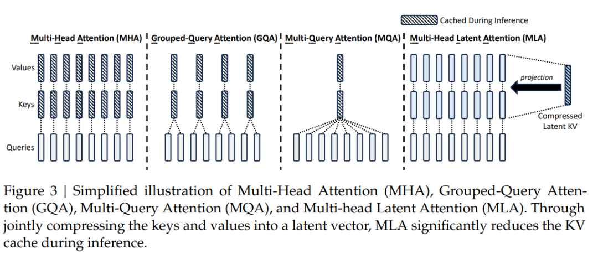

## MHA (Multi-Head Attention)
```python
import torch
import torch.nn as nn

class  MultiHeadAttention(nn.Module):
    def __init__(self, hidden_size, num_heads, drop_out = 0.0):
        assert hidden_size % num_heads == 0
        self.hidden_size = hidden_size
        self.num_heads = num_heads
        self.head_dim = hidden_size//num_heads

        self.to_q = nn.Linear(hidden_size, hidden_size)
        self.to_k = nn.Linear(hidden_size, hidden_size)
        self.to_v = nn.Linear(hidden_size, hidden_size)

        self.dropout = nn.Dropout(drop_out)
        self.output = nn.Linear(hidden_size, hidden_size)

    def forward(self, x, attention_mask = None):
        B, L, C = x.shape

        q = self.to_q(x).view(B,L,self.num_heads,self.head_dim).transpose(1,2)  #[B, head, L, head_dim]
        k = self.to_k(x).view(B,L,self.num_heads,self.head_dim).transpose(1,2)
        v = self.to_v(x).view(B,L,self.num_heads,self.head_dim).transpose(1,2)

        attention = torch.matmul(q, k.permute(0,1,3,2))/(self.head_dim**0.5) #[B, head, L, L]

        if attention_mask is not None:
            attention = attention.masked_fill(attention_mask[:,None,None,:]==0, float('-inf'))
        
        attention = self.dropout(attention.softmax(dim=-1)) 
        context = torch.matmul(attntion, value) #[B, head, L, head_dim]

        context = context.transpose(1,2).contiguous().view(B, L, C) #[B, L, C]
        out = self.output(context)
        return out
```

## MQA (Multi-Query Attention)
```python
import torch
import torch.nn as nn

class  MultiQueryAttention(nn.Module):
    def __init__(self, hidden_size, num_heads, drop_out = 0.0):
        assert hidden_size % num_heads == 0
        self.hidden_size = hidden_size
        self.num_heads = num_heads
        self.head_dim = hidden_size//num_heads

        self.to_q = nn.Linear(hidden_size, hidden_size)
        self.to_k = nn.Linear(hidden_size, self.head_dim)
        self.to_v = nn.Linear(hidden_size, self.head_dim)

        self.dropout = nn.Dropout(drop_out)
        self.output = nn.Linear(hidden_size, hidden_size)

    def forward(self, x, attention_mask = None):
        B, L, C = x.shape

        q = self.to_q(x).view(B,L,self.num_heads,self.head_dim).transpose(1,2)  #[B, head, L, head_dim]
        k = self.to_k(x)  # [B,L,head_dim]
        v = self.to_v(x)

        # 所有head共享k和v的参数
        k = k.unsqueeze(1).expand(-1,self.num_heads,-1,-1)
        v = v.unsqueeze(1).expand(-1,self.num_heads,-1,-1)

        attention = torch.matmul(q, k.permute(0,1,3,2))/(self.head_dim**0.5) #[B, head, L, L]

        if attention_mask is not None:
            attention = attention.masked_fill(attention_mask[:,None,None,:]==0, float('-inf'))
        
        attention = self.dropout(attention.softmax(dim=-1)) 
        context = torch.matmul(attntion, value) #[B, head, L, head_dim]

        context = context.transpose(1,2).contiguous().view(B, L, C) #[B, L, C]
        out = self.output(context)
        return out
```


## GQA (Grouped-Query Attention)
```python
import torch
import torch.nn as nn

class GroupedQueryAttention(nn.Module):
    def __init__(self, hidden_size, num_heads, group_size = 2, drop_out = 0.0):
        self.hidden_size = hidden_size
        self.num_heads = num_heads
        self.group_size = group_size
        assert hidden_size % num_heads == 0
        assert num_heads % group_size == 0

        self.head_dim = hidden_size // num_heads
        self.group_num = num_heads // group_size

        self.to_q = nn.Linear(hidden_size, hidden_size)
        # 分组
        self.to_k = nn.Linear(hidden_size, self.head_dim*self.group_num)
        self.to_v = nn.Linear(hidden_size, self.head_dim*self.group_num)

        self.dropout = nn.Dropout(drop_out)
        self.output = nn.Linear(hidden_size, hidden_size)

    def forward(self, x, attention_mask = None):
        B, L, C = x.shape

        q = self.to_q(x).view(B, L, self.num_heads, self.head_dim).transpose(1, 2) #[B, head, L, head_dim]
        k = self.to_k(x).view(B, L, self.group_num, self.head_dim).transpose(1, 2) # [B, groups, L, head_dim]
        v = self.to_v(x).view(B, L, self.group_num, self.head_dim).transpose(1, 2) # [B, groups, L, head_dim]

        # 每个组里共享同样的k,v
        k = k.unsqueeze(2).expand(-1, -1, self.group_size, -1, -1).contiguous().view(B, -1, L, self.head_dim)  # [B, heads, L, head_dim]
        v = v.unsqueeze(2).expand(-1, -1, self.group_size, -1, -1).contiguous().view(B, -1, L, self.head_dim)

        attention = torch.matmul(q, k.transpose(-1, -2)) / (self.head_dim**0.5)

        if attention_mask is not None:
            attention = attention.masked_fill(attention_mask[:,None,None,:]==0, float('-inf'))
        attention = self.dropout(torch.softmax(attention, dim=-1))

        context = torch.matmul(attention, value) # [B, heads, L, head_dim]
        context = context.transpose(1,2).contiguous().view(B, L, C)

        out = self.output(context)
        return out
```

## MLA(Multi-Head Latent Attention)
```python
import torch
import torch.nn as nn 
import math

class RotaryEmbedding(nn.Module):
    def __init__(self, hidden_size, num_heads, base=10000, max_len=512):
        self.head_dim = hidden_size // num_heads
        self.hidden_size = hidden_size
        self.num_heads = num_heads
        self.base = base
        self.max_len = max_len
        self.cos_pos_cache, self.sin_pos_cache = self._compute_pos_emb()

    def _compute_pos_emb(self):
        theta_i = 1./(self.base**(torch.arange(0, self.head_dim, 2).float()/ self.head_dim))
        positions = torch.arange(self.max_len)
        pos_emb = positions.unsqueeze(1)*theta_i.unsqueeze(0)

        cos_pos = pos_emb.cos().repeat_interleave(2, dim=-1)
        sin_pos = pos_emb.sin().repeat_interleave(2, dim=-1)
        return cos_pos, sin_pos


    def forward(self, q):
        bs, seq_len, _ = q.shape
        cos_pos = self.cos_pos_cache[:seq_len].to(q.device)
        sin_pos = self.sin_pos_cache[:seq_len].to(q.device)

        q = q.reshape(bs,seq_len,self.num_heads,-1).transpose(1, 2)
        cos_pos = cos_pos.repeat(bs,self.num_heads, *([1]*len(cos_pos.shape)))
        sin_pos = sin_pos.repeat(bs,self.num_heads, *([1]*len(sin_pos.shape)))

        q2 = torch.stack([-q[..., 1::2], q[..., ::2]], dim=-1)
        q2 = q2.reshape(q.shape).contiguous()
        return q * cos_pos + q2 * sin_pos

class MultiHeadLatentAttention(nn.Module):
    def __init__(self, hidden_size=256, down_dim=64, up_dim=128, num_heads=8, rope_head_dim=26, drop_out=0.0):
        self.hidden_size = hidden_size
        self.down_dim = down_dim
        self.up_dim = up_dim
        self.num_heads = num_heads
        self.head_dim = hidden_size // num_heads
        self.rope_head_dim = rope_head_dim
        self.v_head_dim = up_dim // num_heads

        # 降维投影
        self.down_proj_kv = nn.Linear(hidden_size, down_dim)
        self.down_proj_q = nn.Linear(hidden_size, down_dim)

        # 升维投影
        self.up_proj_k = nn.Linear(down_dim, up_dim)
        self.up_proj_v = nn.Linear(down_dim, up_dim)
        self.up_proj_q = nn.Linear(down_dim, up_dim)

        # 解耦Q/K投影
        self.proj_qr = nn.Linear(down_dim, rope_head_dim*num_heads)
        self.proj_kr = nn.Linear(hidden_size, rope_head_dim)

        # ROPE位置编码
        self.rope_q = RotaryEmbedding(rope_head_dim*num_heads, num_heads)
        self.rope_k = RotartEmbedding(rope_head_dim, 1)

        # 输出
        self.dropout = nn.Dropout(drop_out)
        self.output = nn.Linear(num_heads*self.v_head_dim, hidden_size)
        self.res_dropout = nn.Dropout(drop_out)

    def forward(self, h, attention_mask = None):
        B, L, C = h.shape

        # step1: 低秩转换
        c_t_kv = self.down_proj_kv(h) # [B, L, down_dim]
        k_t_c = self.up_proj(c_t_kv) # [B, L, up_dim]
        v_t_c = self.up_proj(c_t_kv)

        c_t_q = self.down_proj_q(h) # [B, L, down_dim]
        q_t_c = self.up_proj_q(c_t_q) # [B, L, up_dim]

        # step2: 解耦Q/K处理
        # RoPE投影处理
        q_t_r = self.proj_qr(c_t_q).view(B,L, self.num_heads, self.rope_head_dim).transpose(1,2) # [B, num_heads, L, rope_head_dim]
        q_t_r = self.rope_q(q_t_r)

        k_t_r = self.proj_kr(h).unsqueeze(1) # [B, 1, L, rope_head_dim]
        k_t_r = self.rope_k(k_t_r)

        # step3: 注意力计算
        q_t_c = q_t_c.view(B, L, self.num_heads, self.v_head_dim).transpose(1, 2)
        q = torch.cat([q_t_c, q_t_r], dim=-1)

        k_t_c = k_t_c.view(B, L, self.num_heads, self.v_head_dim).transpose(1, 2)
        k_t_r = k_t_r.expand(-1, self.num_heads, -1, -1)
        k = torch.cat([k_t_c, k_t_r], dim=-1)

        scores = torch.matmul(q,k.transpose(-1,-2))/ (math.sqrt(self.head_dim) + math.sqrt(self.rope_head_dim))

        if attention_mask is not None:
            scores = scores.masked_fill(attention_mask[:,None,None,:] == 0, float('-inf'))
        scores = self.dropout(torch.softmax(scores, dim=-1))
        context = torch.matmul(scores, v_t_c)
        
        context = context.transpose(1,2).contiguous().view(B, L, -1)
        out = self.res_dropout(self.output(context))
        return out


```