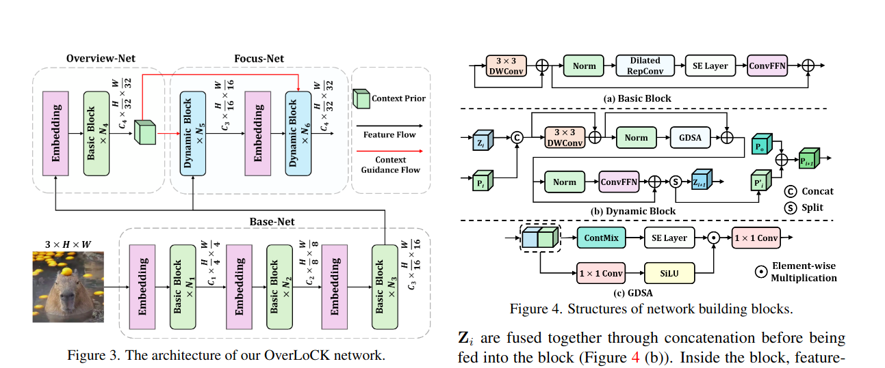

## Title: OverLoCK: An Overview-first-Look-Closely-next ConvNet  with Context-Mixing Dynamic Kernels
[CVPR 2025 Oral](https://arxiv.org/pdf/2502.20087) [code](https://github.com/LMMMEng/OverLoCK)

## background and issue
在日常生活中，设想观看一张图像，我们通常首先会对图像的语义信息有一个整体的认知，然后再进行更仔细地观察。作者将这种现象称为自上而下的注意力(Top-down attention)。

### [top-down attention and bottom-up attention](https://zhuanlan.zhihu.com/p/612475689)

> 当一个场景里有多个物体时，正常的vision transformer会highlight出所有的物体。然而在实际生活中，当我们执行一个任务的时候，我们只会关注和当前任务有关的物体，也就是说，人类的attention不仅和image本身有关（bottom-up attention），而且是受high-level的task/goal调控的（top-down attention）。我们可以从Bayesian Inference的角度出发，得到了一个拥有top-down attention能力的vision transformer（AbSViT）。我们可以用自然语言去控制它的attention，这一特性带来了在一系列Visual-Language任务上的提升。我们也可以把它作为一个general backbone，用来提升image classification，semantic segmentation，以及model robustness的性能。

这篇文章指出，当我们在做Top-Down Attention时，我们实际上在做Bayesian Inference。

### [Bayesian Inference](https://zhuanlan.zhihu.com/p/661548936)
先了解一下定义：
- **P(A)叫做先验概率**(类似的P(B)、P(C)也是)；**P(A|D)叫做后验概率**(类似的P(B|D)、P(C|D)也是)。意思是有了实验数据D之后对A重新做了新的概率判断，修订了原来的先验概率。 
- **P(D|A)叫做似然likelyhood**：假设A为条件，D的可能性有多大？(类似的P(D|B)、P(D|C)也是似然)
- **P(D)叫做边缘概率**，也叫显著性证据。实际上有：
显著性证据=∑{先验概率*似然}，即$$P(D)=P(D|A)P(A) + P(D|B)P(B) + ...$$
于是从条件概率定义有完整的贝叶斯推断公式：

$$P(A|D) = P(AD)/P(D) = P(D|A)P(A)/P(D) \\\\
= P(D|A)P(A)/[P(D|A)P(A) + P(D|B)P(B) + ...]$$ 

- 先验概率乘以似然度的乘积P(D|A)P(A)在贝叶斯推断中被称为**先验似然度（prior likelihood）**。(类似的P(D|B)P(B)、P(D|C)P(C)也是先验似然度)
- 实际上**后验概率就是先验似然度在总的先验似然度中的占比**。
- **P(D|A)/P(D|¬A) 叫做似然比（likelihood ratio）**。(类似的P(D|B)/P(D|¬B) 、P(D|C)/P(D|¬C) 也是)
- **P(A|D)/P(A)被称为贝叶斯因子Bayes factor**(类似的P(B|D)/P(B)、P(C|D)/P(C)也是)，是A的支持度。

#### 贝叶斯推理
1. 利用贝叶斯因子做推断：
    贝叶斯因子是在贝叶斯推断中用于评估观测数据对不同假设的支持程度的一个指标。它是后验概率与先验概率的比值，表示在观测到数据D的情况下，相对于假设A不成立的情况，假设A成立的可能性有多大。

    当贝叶斯因子大于1时，意味着观测到的数据更有利于假设A成立，因此可以倾向于推断A成立。
    当贝叶斯因子小于1时，意味着观测到的数据更有利于假设A不成立，因此可以倾向于推断A不成立。
    贝叶斯因子的值越大，表示数据对假设A的支持程度越高，而值越小表示数据对假设A的支持程度越低。
2. 预测：
    根据D得到后验概率之后，我们可以进行预测事件X发生的概率

$$P(X|D)=P(X|A)*P(A|D) + P(X|B)*P(B|D) + P(X|C)*P(C|D) + ...$$

### issue
现有的top-down attention方法，一方面由于模型设计不兼容，不适合构建现代视觉主干；而其余方法主要集中在递归架构，带来了额外的计算开销，导致性能和计算复杂性之间的次优权衡。**top-down attention的一个关键特性是使用反馈信号作为明确的指导，以在场景中定位有意义的区域。**然而，大多数现有的视觉backbone中采用的经典分层架构与这种生物机制形成鲜明对比，因为它从低级到高级编码特征，当前层的输入特征仅依赖于前一层的特征。

文章指出现有的视觉backbone，如Vision Mamba, Swin, ConvNeXt等，难以在特征图中使用正确的类别标签准确定位对象。由此引入了第一个问题：**如何将top-down attention引入当前的视觉模型中，并权衡性能表现和模型复杂度？**基于此，文章提出了基本的网络架构，即分为Base-Net, Overview-Net和Focus-Net。其中Focus-Net主要获取精确的，信息丰富的高级表示，因此**既要考虑远距离建模能力，也要考虑局部的inductive bias**。所以其实又回到了经典的问题，如何平衡这两种能力？

现有的方法：Self-attention和SSM提供了强大的远距离建模能力，但是欠缺局部信息的表示，并且计算复杂度高；大核卷积和动态卷积在输入图像分辨率越来越大的情况下，由于核尺寸固定，仍然局限于有限区域，这表明其长程建模能力较弱。
虽然可变形卷积可以在一定程度上缓解这些问题，但可变形的核形状牺牲了卷积固有的归纳偏差，导致局部感知能力相对较弱。

为了解决这个问题，文章提出Context-Mixing，充分利用Overview-Net提供了context prior来建模远距离的依赖关系。

## Methods

### Context Mixing
 ContMix 网络结构 (b) ContMix在建模远距离依赖关系和局部偏差的示意图")

