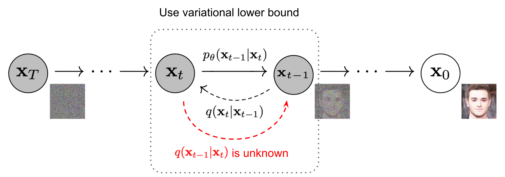
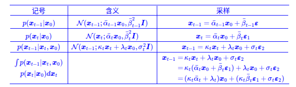

## Preliminary Knowledge

### 条件概率公式

条件概率的一般形式：

$$
P(A,B,C)=P(C|B,A)P(B,A)=P(C|B,A)P(B|A)P(A)
$$

$$
P(B,C|A)=P(C|B,A)P(B|A)
$$

马尔可夫条件：下一状态的概率分布只能由当前状态决定，与前面的状态无关。

$$
P(A,B,C)=P(C|B)P(B|A)P(A)
$$

$$
P(B,C|A)=P(C|B)P(B|A)
$$

### KL散度

KL散度是衡量两个概率分布之间差异的一种度量方法，它衡量了从一个分布到另一个分布所需的额外信息。KL散度的定义是建立在熵 Entropy 的基础上的，熵的定义如下：

$$
H(X)=-\sum_{i=1}^{n}p_i\log p_i
$$

规定当 $p_i=0$ 时，$p_i\log p_i=0$

$$
H(p,q)=-\sum_{i=1}^{n}p(x)\log q(x)
$$

在信息论中，交叉熵可认为是对预测分布 $q(x)$ 用真实分布 $p(x)$ 来进行编码时所需要的信息量大小。因此我们可以通过交叉熵和信息熵来推导相对熵（KL散度）：

$$
\begin{align}
KL(p\parallel q)&=H(p,q)-H(p) \\\\
&=-\sum_{i=1}^{n}p(x)\log q(x)+\sum_{i=1}^{n}p(x)\log p(x) \\\\
&=-\sum_{i=1}^{n}p(x)\log \frac{q(x)}{p(x)}
\end{align}
$$

KL散度的特点：

1. 非对称性：$KL(p\parallel q)\neq KL(q\parallel p)$  
2. 非负性：$KL(p\parallel q)\geq 0$

*如果固定$p(x)$，那么$KL(p\parallel q)=0 \Leftrightarrow p(x)=q(x)$。实际上这一点的证明要用到变分法，也是VAE中V的由来。*

$$
\begin{align}
p(x)&=\frac{1}{\sqrt{2\pi}\sigma_1}\exp\left({-\frac{(x-\mu_1)^2}{2\sigma_1^2}}\right) \\\\
q(x)&=\frac{1}{\sqrt{2\pi}\sigma_2}\exp\left({-\frac{(x-\mu_1)^2}{2\sigma_2^2}}\right)
\end{align}
$$

$$
\begin{align}
\int p(x)\log(p(x))dx &= -\frac{1}{2}\left[1+\log(2\pi\sigma_1^2)\right] \\\\
\int p(x)\log(q(x))dx &= -\frac{1}{2}\log(2\pi\sigma_2^2)-\frac{\sigma_1^2+(\mu_1-\mu_2)^2}{2\sigma_2^2}
\end{align}
$$

$$
KL(p\parallel q)=\log\frac{\sigma_2}{\sigma_1}+\frac{\sigma_1^2+(\mu_1-\mu_2)^2}{2\sigma_2^2}-\frac{1}{2}
$$

### 高斯分布的重参数化

若希望从高斯分布中采样，我们可以使用标准正态分布 $\mathcal{N}(0,1)$ 来采样 $z$，然后通过重参数化 $\sigma*z+\mu$ 的方式将其转换为高斯分布 $N(\mu,\sigma^2)$。

这样做的好处在于将随机性转移到了 $z$ 这个常量上，使得采样过程梯度可传播，从而可以使用梯度下降等优化算法进行训练。

---
## 生成模型

## VAE
首先我们先回顾一下VAE在干什么：

我们有一批数据样本$\{x_1,x_2,...,x_n\}$，对这个整体我们用$x$描述，我们的理想情况是得到$x$的分布$\tilde{p}(x)$，这样我们就可以直接根据$\tilde{p}(x)$来采样得到所有可能的$x$了，但是这显然很难实现。因此我们引入了$z$，$z$服从标准正态分布$\mathcal{N}(0,I)$，也就是说，我们可以先从标准正态分布中采样一个$z$，然后训练一个模型$q_{\theta}(x|z)$来算出$x$，用苏神的图解释该过程

$$
q(x)=\int q_{\theta}(x|z)q(z)dz
$$

$$
q(x, z)= q(x|z)q(z)
$$

但是，实际上这个过程是存在问题的，我们并不清楚在标准正态分布中采样得到$z_{k}$是否对应原来的$x_{k}$，因此，我们不能简单地最小化$x_{k}$和$\hat{x}_{k}$之间的距离。

实际上在VAE中，我们假设的是后验分布$p(z|x)$为正态分布，也就是说，给定一个样本$x_k$，我们假设存在一个专属于$x_k$的分布$p(z|x_k)$，并且假设其为正态分布。这样我们从这个分布中采样出来的$z_k$可以确定是与$x_k$对应的。

那么如何得到这个专属的分布呢？既然已经假设他是一个正态分布了，那我们就只要知道他的均值$\mu$ 和方差$\sigma^2$就行了。怎么算均值和方差呢？那就用神经网络拟合出来吧！

如何优化呢？我们的目标是希望$q(x)$能够逼近$\tilde{p}(x)$，这样的话就可以利用KL散度。具体来说，我们用$q(x,z)$来逼近$p(x,z)=\tilde{p}(x)p(z|x)$:

$$
KL(p(x,z)\parallel q(x,z)) = \int\int p(x,z)\ln\frac{p(x,z)}{q(x,z)}dzdx
$$

$$
\begin{align}
KL(p(x,z)\parallel q(x,z)) &= \int\tilde{p}(x)\left [\int p(z|x)\ln\frac{p(x,z)}{q(x,z)}dz\right ]dx \\\\
&=\mathbb{E}_{x\sim \tilde{p}(x)}\left [\int p(z|x)\ln\frac{p(x,z)}{q(x,z)}dz\right ]
\end{align}
$$

进一步省略$\tilde{p}(x)$带来的常数项：

$$
\mathcal{L} = KL(p(x,z)\parallel q(x,z)) = \mathbb{E}_{x\sim \tilde{p}(x)}\left[\int p(z|x)\ln\frac{p(x|z)}{q(x,z)}dz\right]
$$

再将 $q(x, z)= q(x|z)q(z)$ 代入，有：

$$
\mathcal{L} = \mathbb{E}\_{x\sim \tilde{p}(x)} \left [\mathbb{E}\_{z\sim p(z|x)}[-\ln q(x|z)] + KL(p(z|x) \parallel  q(z))\right ]
$$

因此，我们目标就是优化 $q(x|z)$ 和 $q(z)$ 使得 $\mathcal{L}$ 最小化。

在代码实现过程中，$q(z)$ 假设为标准正态分布，$p(z|x),q(x|z)$ 分别对应Encoder和Decoder部分，都是未知的，这里我们都用神经网络来进行拟合。

首先对于 $p(z|x)$ ，我们假设其为均值为 $\mu(x)$，方差为 $\sigma^2(x)$ 的正态分布，$\mu(x)$ 和 $\sigma^2(x)$ 为输入为 $x$ ，输出为均值和方法的神经网络。因此loss中的KL散度项可以计算出来：

$$
KL(p(z|x)\parallel q(z)) = \frac{1}{2}\sum^{d}\_{k=1}(\mu^2_{(k)}(x)+\sigma^2_{(k)}(x)-\ln\sigma^2_{(k)}(x)-1)
$$

对于 $q(x|z)$ ，VAE论文给出了两种分布：伯努利分布以及正态分布，我们仍然以正态分布为例，仍然依靠神经网络估计均值和方差，$\tilde{\mu}(z)$，$\tilde{\sigma}^2(z)$，但是在这里我们通常会将方差固定为常数 $\tilde{\sigma}^2$ ，因此：

$$
-\ln q(x|z) \sim \frac{1}{2\tilde{\sigma}^2}||x-\tilde{\mu}(z)||^2
$$

在VAE中我们从 $p(z|x)$ 采样一个样本进行训练，那么也就是说：

$$
\mathcal{L} = \mathbb{E}_{x\sim \tilde{p}(x)}\left [-\ln q(x|z) + KL(p(z|x) \parallel  q(z))\right ]
$$

这样训练的loss也就能精确的计算出来了。

---

## Diffusion Models
主要参考了[Lil's Log](https://lilianweng.github.io/posts/2021-07-11-diffusion-models/#quick-summary)，苏神的[生成扩散模型漫谈系列](https://spaces.ac.cn/)
### DDPM
### 前向扩散过程（加噪）
*Given a data point sampled form a real data distribution $x_0 \sim q(x)$, we  define a **forward diffusion process**: we add small amount of Gaussian noise to the sample in $T$ steps, producing a sequence of noisy samples $x_1,...,x_T$. The step sizes are controlled by a variance schedule $\{\beta_{t}\in(0,1)\}_{t=1}^{T}$.*

$$
\begin{align}
q(x_t|x_{t-1}) &= \mathcal{N}(x_t; \sqrt{1-\beta_t}x_{t-1}, \beta_t I) \\\\
q(x_{1:T}|x_0) &= \prod_{t=1}^{T}q(x_t|x_{t-1})
\end{align}
$$

这里的前向过程可以视为马尔可夫过程，即当前状态$x_t$只与上一时刻的状态$x_{t-1}$有关。在给定上一状态$x_{t-1}$的条件下，获取第$t$步样本$x_t$的概率分布q(x_t|x_{t-1})。$\mathcal{N}(x_t; \sqrt{1-\beta_t}x_{t-1}, \beta_t I)$ 表示给定上一步的状态$x_{t-1}$， $x_{t}$是一个以$\sqrt{1-\beta_t}x_{t-1}$为均值, $\beta_t I$为协方差的高斯分布的随机变量.

也就是说：$x_{t} = \sqrt{\alpha_t}x_{t-1}+\sqrt{1-\alpha_{t}}\epsilon_{t-1}, \epsilon_{t-1}\in\mathcal{N}(0,I)$

因此，当步数$t$逐渐增大时，采样数据$x_0$会逐渐趋向于纯高斯噪声

*At any arbitrary time step $t$, we can sample $x_t$ in above process. Let $\alpha_{t} = 1-\beta_{t}$, $\bar{\alpha}\_{t} = \prod\_{i=1}^{t}\alpha\_{i}$ and $\bar{\beta}\_{t} = \sqrt{1-\bar{\alpha}\_{t}^2}$*:

$$
\begin{align}
x_{t} &= \sqrt{\alpha\_t}x\_{t-1}+\sqrt{1-{\alpha}\_{t}}\epsilon\_{t} \\\\
\nonumber
&=\sqrt{\alpha_t\alpha\_{t-1}}x\_{t-2}+\sqrt{1-\alpha\_{t}\alpha\_{t-1}}\epsilon\_{t-2} \\\\
\nonumber
&=... \\\\
\nonumber
&=\sqrt{\bar{\alpha}\_{t}}x\_{0}+\sqrt{1-\bar{\alpha}\_{t}}\epsilon \\\\
q(x\_t|x\_0) &= \mathcal{N}(x\_t; \sqrt{\bar{\alpha}\_{t}}x\_{0}, (1-\bar{\alpha}\_{t})I)
\end{align}
$$

### 反向扩散过程（去噪）
*If we can reverse the forward process and sample from $q(x_{t-1}|x_t)$, we will be able to recreate the true sample form a Gaussian noise input, $x_{T} \sim \mathcal{N}(0,I)$. Unfortunately, we cannot easily estimate $q(x_{t-1}|x_t)$ because it needs to use the entire dataset and therefore we need to learn a model $p_{\theta}$ to approximate these conditional probabilities in order to run the reverse diffusion process*.

$$
\begin{align}
p_{\theta}(x_{0:T}) &= p(x_T)\prod_{i=1}^{t}p_{\theta}(x_{t-1}|x_t) \\\\
p_{\theta}(x_{t-1}|x_t) &= \mathcal{N}(x_{t-1};\mu_{\theta}(x_t,t), \Sigma_{\theta}(x_t,t))
\end{align}
$$

如何学习这一过程呢？最简单的方法就是最小化$x_{t-1}$和$p_{\theta}(x_{t-1}|x_t)$之间的欧式距离：

$$
||x_{t-1}-p_{\theta}(x_{t-1}|x_t)||^{2}
$$

继续细化这一过程，将前向过程可以改写为$x_{t-1}=\frac{1}{\sqrt{\alpha_t}}(x_t-\sqrt{1-\alpha_{t}}\epsilon_{t})$，因此模型$p_{\theta}$可以设计为：

$$
p_{\theta}(x_{t-1}|x_t) = \frac{1}{\sqrt{\alpha_t}}(x_t-\sqrt{1-\alpha_{t}}\epsilon_{\theta}(x_t,t))
$$

代入训练损失函数：

$$
||x_{t-1}-p_{\theta}(x_{t-1}|x_t)||^{2} = \frac{\beta_{t}}{\alpha_t}||\epsilon_{t}-\epsilon_{\theta}(x_t,t)||^{2}
$$

忽略常数系数 $\frac{\beta\_{t}}{\alpha\_t}$，然后代入 $x_{t} = \sqrt{\bar{\alpha}\_{t}}x\_{0}+\sqrt{1-\bar{\alpha}\_{t}}\epsilon$，最终得到的损失函数：

$$
||\epsilon\_{t}-\epsilon\_{\theta}(\sqrt{\bar{\alpha}\_{t}}x\_{0}+\sqrt{1-\bar{\alpha}\_{t}}\epsilon\_{t},t)||^{2}
$$

### DDIM
我们也可以用贝叶斯重新认识DDPM的过程：

正向过程每一步是 $x_{t} = \sqrt{\alpha_t}x_{t-1}+\sqrt{1-\alpha_{t}}\epsilon_{t-1}, \epsilon_{t-1}\in\mathcal{N}(0,I)$，可以求出 $q(x\_t|x\_0) = \mathcal{N}(x\_t; \sqrt{\bar{\alpha}\_{t}}x\_{0}, (1-\bar{\alpha}\_{t})I)$。DDPM要做的事就是从正向过程中求出反向过程所需要的 $q(x_{t-1}|x_t)$，这样就可以实现从任意 $x_T=z$ 出发，逐步采样出$x_{T-1}, x_{T-2}, ...$ 一直到 $x_0$。

那么，根据贝叶斯定理，我们有：

$$
q(x_{t-1}|x_{t}) = \frac{q(x_{t}|x_{t-1})q(x_{t-1})}{q(x_t)}
$$

我们不知道 $q(x_{t-1})$ 和 $q(x_t)$ 的表达式，但是我们知道的 $x_0$，因此我们可以将 $x_0$ 加入得到：

$$
q(x_{t-1}|x_{t}, x_0) = \frac{q(x_{t}|x_{t-1})q(x_{t-1}|x_0)}{q(x_t|x_0)}
$$

这样公式的每一项我们都是已知的，所以上式是可以计算出来的：

$$
\begin{align}
q({x}\_{t-1}|{x}\_t,{x}\_0)=\mathcal{N}\left({x}\_{t-1};\frac{\alpha\_t\bar{\beta}\_{t-1}^2}{\bar{\beta}\_t^2}{x}\_t+\frac{\bar{\alpha}\_{t-1}\beta\_t^2}{\bar{\beta}\_t^2}{x}\_0,\frac{\bar{\beta}\_{t-1}^2\beta\_t^2}{\bar{\beta}\_t^2}{I}\right)
\label{eq_backward}
\end{align}
$$

目前 $q({x}\_{t-1}|{x}\_t,{x}\_0)$ 有两个依赖项$x_t, x_0$，但实际上 $x_0$ 是我们最终想要生成的结果，我们不能依赖 $x_0$。那么一个自然的想法是如果我们能够通过 $x_t$ 来预测 $x_0$，不就可以避免这一问题了吗？因此可以引入去噪模型 $\bar{\mu}(x_t)$ 来预测 $x_0$：

$$
\bar{\mu}(x_t) = \frac{1}{\bar{\alpha}\_t}(x_t-\bar{\beta}\_t\epsilon_{\theta}(x_t,t))
$$

代入 $\eqref{eq_backward}$，可以得到：
$$
q({x}\_{t-1}|{x}\_t,{x}\_0) \approx \mathcal{N}\left({x}\_{t-1};\frac{1}{\alpha\_t}\left(x_t-\frac{\beta\_t^2}{\bar{\beta}\_t}\epsilon\_{\theta}(x_t, t)\right),\frac{\bar{\beta}\_{t-1}^2 \beta\_t^2}{\bar{\beta}\_t^2}I\right)
$$

虽然我们从单步正向过程 $q(x_t|x_{t-1})$ 一步步推导到 $q({x}\_{t-1}|{x}\_t,{x}\_0)$，但是我们可以看到实际上结果与 $q(x_t|x_{t-1})$ 并没有什么关系，那么DDIM的思想就是在推导过程中舍弃掉 $q(x_t|x_{t-1})$。那么该如何求解 $q({x}\_{t-1}|{x}\_t,{x}\_0)$ 呢？

DDIM提出用待定系数法求解，我们仍然假设 $q({x}\_{t-1}|{x}\_t,{x}\_0)$ 为正态分布：

$$
\begin{align}
q({x}\_{t-1}|{x}\_t,{x}\_0) = \mathcal{N}\left(x_{t-1}; \kappa\_{t}x_t+\lambda\_{t}x_0, \sigma\_{t}^2 I\right)
\label{eq_ddim}
\end{align}
$$

并且该分布需要满足边际分布条件：
$$
\int q({x}\_{t-1}|{x}\_t,{x}\_0)q(x_t|x_0) = q(x_{t-1}|x_0)
$$

想要满足该条件，其实只需要满足两个方程：
$$
\begin{align}
\bar{\alpha}\_{t-1} &= \kappa\_{t}\bar{\alpha}\_{t}+\lambda\_{t} \\\\
\bar{\beta}\_{t-1} &= \sqrt{\kappa\_{t}^2\bar{\beta}\_{t}^2+\lambda\_{t}^2}
\end{align}
$$

*关于如何得到这两个方程，可以参考苏神[生成扩散模型漫谈（四）](https://spaces.ac.cn/archives/9181)*

解这两个方程，可以得到 $\kappa\_{t}$ 和 $\lambda\_{t}$ 的表达式：

$$
\begin{align}
\kappa\_{t} &= \frac{\sqrt{\bar{\beta}\_{t-1}^2-\sigma\_t^2}}{\bar{\beta}\_t} \\\\
\lambda\_{t} &= \bar\alpha_{t-1}-\frac{\bar\alpha\_t\sqrt{\bar{\beta}\_{t-1}^2-\sigma\_t^2}}{\bar{\beta}\_t}
\end{align}
$$

可以代入 $\eqref{eq_ddim}$，同时将$x_0$替换为用$x_t$推导的形式(和DDPM一样)，最终得到：
$$
\begin{align}
q(x_{t-1}|x_t) \approx \mathcal{N}\left({x}\_{t-1};\frac{1}{\alpha\_t}\left(x_t-\left(\bar\beta_t-\alpha_t\sqrt{\bar\beta_{t-1}^2-\sigma_t^2}\right)\epsilon\_{\theta}(x_t, t)\right),\sigma_t^2 I\right)
\end{align}
$$

## Conditioned Generation
### Classifier Guided Diffusion 
updating.....