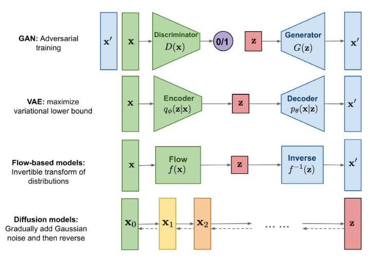

## Preliminary Knowledge

### 条件概率公式

条件概率的一般形式：

$$
P(A,B,C)=P(C|B,A)P(B,A)=P(C|B,A)P(B|A)P(A)
$$

$$
P(B,C|A)=P(C|B,A)P(B|A)
$$

马尔可夫条件：下一状态的概率分布只能由当前状态决定，与前面的状态无关。

$$
P(A,B,C)=P(C|B)P(B|A)P(A)
$$

$$
P(B,C|A)=P(C|B)P(B|A)
$$

### KL散度

KL散度是衡量两个概率分布之间差异的一种度量方法，它衡量了从一个分布到另一个分布所需的额外信息。KL散度的定义是建立在熵 Entropy 的基础上的，熵的定义如下：

$$
H(X)=-\sum_{i=1}^{n}p_i\log p_i
$$

规定当 $p_i=0$ 时，$p_i\log p_i=0$

$$
H(p,q)=-\sum_{i=1}^{n}p(x)\log q(x)
$$

在信息论中，交叉熵可认为是对预测分布 $q(x)$ 用真实分布 $p(x)$ 来进行编码时所需要的信息量大小。因此我们可以通过交叉熵和信息熵来推导相对熵（KL散度）：

$$
\begin{align}
D_{KL}(p||q)&=H(p,q)-H(p) \\\\
&=-\sum_{i=1}^{n}p(x)\log q(x)+\sum_{i=1}^{n}p(x)\log p(x) \\\\
&=-\sum_{i=1}^{n}p(x)\log \frac{q(x)}{p(x)}
\end{align}
$$

KL散度的特点：

1. 非对称性：$D_{KL}(p||q)\neq D_{KL}(q||p)$  
2. 非负性：$D_{KL}(p||q)\geq 0$

$$
\begin{align}
p(x)&=\frac{1}{\sqrt{2\pi}\sigma_1}\exp\left({-\frac{(x-\mu_1)^2}{2\sigma_1^2}}\right) \\\\
q(x)&=\frac{1}{\sqrt{2\pi}\sigma_2}\exp\left({-\frac{(x-\mu_1)^2}{2\sigma_2^2}}\right)
\end{align}
$$

$$
\begin{align}
\int p(x)\log(p(x))dx &= -\frac{1}{2}\left[1+\log(2\pi\sigma_1^2)\right] \\\\
\int p(x)\log(q(x))dx &= -\frac{1}{2}\log(2\pi\sigma_2^2)-\frac{\sigma_1^2+(\mu_1-\mu_2)^2}{2\sigma_2^2}
\end{align}
$$

$$
D_{KL}(p||q)=\log\frac{\sigma_2}{\sigma_1}+\frac{\sigma_1^2+(\mu_1-\mu_2)^2}{2\sigma_2^2}-\frac{1}{2}
$$

### 高斯分布的重参数化

若希望从高斯分布中采样，我们可以使用标准正态分布 $\mathcal{N}(0,1)$ 来采样 $z$，然后通过重参数化 $\sigma*z+\mu$ 的方式将其转换为高斯分布 $N(\mu,\sigma^2)$。

这样做的好处在于将随机性转移到了 $z$ 这个常量上，使得采样过程梯度可传播，从而可以使用梯度下降等优化算法进行训练。

---

## VAE 与多层 VAE

### 单层 VAE

$$
p(x)=\int_{z} p(x, z)
$$

$$
p(x)=\int_{z} p_{\theta}(x|z)p(z)
$$

$$
p(x)=\int_{z} q_{\phi}(z|x)\frac{p_{\theta}(x|z)p(z)}{q_{\phi}(z|x)}
$$

$$
\begin{align}
\log p(x) &= \log \int_{z} q_{\phi}(z|x)\frac{p_{\theta}(x|z)p(z)}{q_{\phi}(z|x)} \\\\
&= \log \mathbb{E}_{z\sim q_{\phi}(z|x)}\left[\frac{p_{\theta}(x|z)p(z)}{q_{\phi}(z|x)}\right]
\end{align}
$$

$$
\begin{align}
\log p(x) &\ge \mathbb{E}_{z\sim q_{\phi}(z|x)}\left[\log \frac{p_{\theta}(x|z)p(z)}{q_{\phi}(z|x)}\right] \\
&= \mathbb{E}_{z\sim q_{\phi}(z|x)}[\log p_{\theta}(x|z)] - D_{KL}(q_{\phi}(z|x) || p(z))
\end{align}
$$

第一项为重建项，第二项为正则化项。

### 多层 VAE

（待更新）

---

## Diffusion Models

（待更新）
