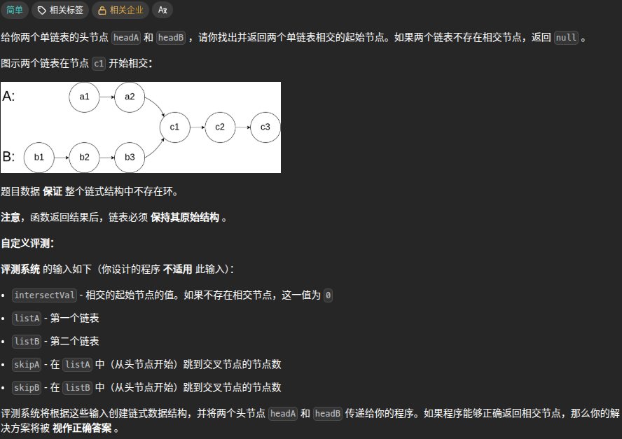
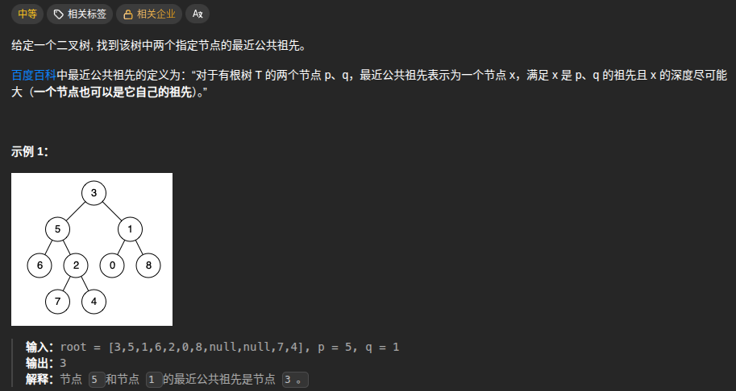

## [160.相交链表](https://leetcode.cn/problems/intersection-of-two-linked-lists/?envType=problem-list-v2&envId=2cktkvj&)


题解：
参考[灵茶山艾府](https://leetcode.cn/problems/intersection-of-two-linked-lists/solutions/2958778/tu-jie-yi-zhang-tu-miao-dong-xiang-jiao-m6tg1/?envType=problem-list-v2&envId=2cktkvj&)题解
```python
# Definition for singly-linked list.
# class ListNode:
#     def __init__(self, x):
#         self.val = x
#         self.next = None

class Solution:
    def getIntersectionNode(self, headA: ListNode, headB: ListNode) -> Optional[ListNode]:
        p1 = headA
        p2 = headB
        while p1 is not p2:
            p1 = p1.next if p1 else headB
            p2 = p2.next if p2 else headA
        return p1
```

**核心思想是两条链表满足 $(x+z)+y = (y+z)+x$，z为公共部分的长度**

## [236.二叉树的最近公共祖先](https://leetcode.cn/problems/lowest-common-ancestor-of-a-binary-tree/description/?envType=problem-list-v2&envId=2cktkvj&)



题解：

```python
# Definition for a binary tree node.
# class TreeNode:
#     def __init__(self, x):
#         self.val = x
#         self.left = None
#         self.right = None

class Solution:
    def lowestCommonAncestor(self, root: 'TreeNode', p: 'TreeNode', q: 'TreeNode') -> 'TreeNode':
        if root in (None, p, q):
            return root
        left = self.lowestCommonAncestor(root.left,p,q)
        right = self.lowestCommonAncestor(root.right,p,q)
        if left and right:
            return root
        return left or right
```