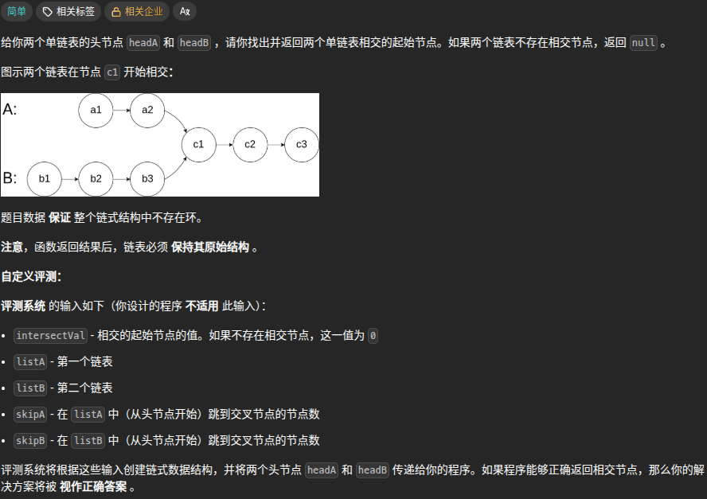
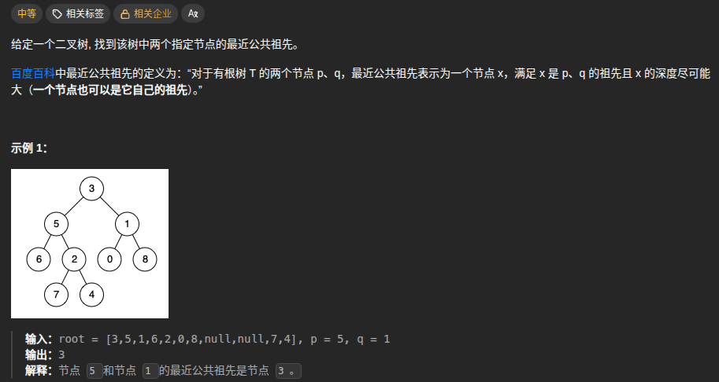

## 链表

### [LC160.相交链表](https://leetcode.cn/problems/intersection-of-two-linked-lists/?envType=problem-list-v2&envId=2cktkvj&)


题解：
参考[灵茶山艾府](https://leetcode.cn/problems/intersection-of-two-linked-lists/solutions/2958778/tu-jie-yi-zhang-tu-miao-dong-xiang-jiao-m6tg1/?envType=problem-list-v2&envId=2cktkvj&)
**核心思想是两条链表满足 $(x+z)+y = (y+z)+x$，z为公共部分的长度**
```python
# Definition for singly-linked list.
# class ListNode:
#     def __init__(self, x):
#         self.val = x
#         self.next = None

class Solution:
    def getIntersectionNode(self, headA: ListNode, headB: ListNode) -> Optional[ListNode]:
        p1 = headA
        p2 = headB
        while p1 is not p2:
            p1 = p1.next if p1 else headB
            p2 = p2.next if p2 else headA
        return p1
```
### [LC206.反转链表](https://leetcode.cn/problems/reverse-linked-list/description/?envType=problem-list-v2&envId=2cktkvj&)
**给你单链表的头节点 head ，请你反转链表，并返回反转后的链表。**

题解：
```python
class ListNode:
    def __init__(self, val=0, next=None):
        self.val = val
        self.next = next

class Solution:
    def reverseList(self, head: Optional[ListNode]) -> Optional[ListNode]:
        cur = head
        pre = None
        while cur:
            nxt = cur.next
            cur.next = pre
            pre = cur
            cur = nxt
        return pre

```

## 树

### [LC236.二叉树的最近公共祖先](https://leetcode.cn/problems/lowest-common-ancestor-of-a-binary-tree/description/?envType=problem-list-v2&envId=2cktkvj&)



题解：

```python
# Definition for a binary tree node.
# class TreeNode:
#     def __init__(self, x):
#         self.val = x
#         self.left = None
#         self.right = None

class Solution:
    def lowestCommonAncestor(self, root: 'TreeNode', p: 'TreeNode', q: 'TreeNode') -> 'TreeNode':
        if root in (None, p, q):
            return root
        left = self.lowestCommonAncestor(root.left,p,q)
        right = self.lowestCommonAncestor(root.right,p,q)
        if left and right:
            return root
        return left or right
```

### [LC437.路径总和II](https://leetcode.cn/problems/path-sum-ii/description/?envType=problem-list-v2&envId=2cktkvj&)
**给定一个二叉树, 找到该树中两个指定节点的最近公共祖先。**
题解：
```python
class TreeNode:
    def __init__(self, val=0, left=None, right=None):
        self.val = val
        self.left = left
        self.right = right

class Solution:
    def pathSum(self, root, targetSum):
        ans = []
        path = []
        def dfs(node, target):
            if node is None:
                return
            target-=node.val
            path.append(node.val)
            if node.left is None and node.right is None and target==0:
                ans.append(path.copy())
            else:
                dfs(node.left, target)
                dfs(node.right, target)
            path.pop()
        dfs(root, targetSum)
        return ans
```

### [LC236.二叉树的最近公共祖先](https://leetcode.cn/problems/lowest-common-ancestor-of-a-binary-tree/description/?envType=problem-list-v2&envId=2cktkvj&)
**给定一个二叉树, 找到该树中两个指定节点的最近公共祖先。**
题解：临界条件：当前节点是空/p/q

如果左右子树都找到了，返回当前节点，如果只有左子树有结果，返回递归左子树的结果，相反返回右子树的递归结果。
```python
class TreeNode:
    def __init__(self, val=0, left=None, right=None):
        self.val = val
        self.left = left
        self.right = right

class Solution:
    def lowestCommonAncestor(self, root: 'TreeNode', p: 'TreeNode', q: 'TreeNode') -> 'TreeNode':
        def dfs(node, p, q):
            if node is p or node is q or node is None:
                return node
            left = dfs(node.left, p, q)
            right = dfs(node.right, p, q)
            if left and right:
                return node
            return left or right
        return dfs(root, p, q)
```

### [LC543.二叉树的直径](https://leetcode.cn/problems/diameter-of-binary-tree/description/?envType=problem-list-v2&envId=2cktkvj&)
**给定一棵二叉树，你需要计算它的直径长度。一棵二叉树的直径长度是任意两个结点路径长度中的最大值。这条路径可能穿过也可能不穿过根结点。**
题解：对于每个节点，计算左右子树的深度，更新答案为左右子树深度之和
```python
class TreeNode:
    def __init__(self, val=0, left=None, right=None):
        self.val = val
        self.left = left
        self.right = right

class Solution:
    def diameterOfBinaryTree(self, root: Optional[TreeNode]) -> int:
        ans = 0
        def dfs(node):
            if node is None:
                return -1
            left = dfs(node.left)+1
            right = dfs(node.right)+1
            nonlocal ans
            ans = max(ans, left+right)
            return max(left, right)
        dfs(root)
        return ans
```

### [LC124.二叉树中的最大路径和](https://leetcode.cn/problems/binary-tree-maximum-path-sum/description/?envType=problem-list-v2&envId=2cktkvj&)
**给定一个非空二叉树，返回其最大路径和。**
题解：
```python
class TreeNode:
    def __init__(self, val=0, left=None, right=None):
        self.val = val
        self.left = left
        self.right = right
    
class Solution:
    def maxPathSum(self, root: Optional[TreeNode]) -> int:
        ans = -inf
        def dfs(node):
            nonlcoal ans
            if node is None:
                return 0
            left = dfs(node.left)
            right = dfs(node.right)
            ans = max(ans, left+right+node.val)
            return max(max(left, right)+node.val, 0)
        dfs(root)
        return ans
```

### [LC199.二叉树的右视图](https://leetcode.cn/problems/binary-tree-right-side-view/description/?envType=problem-list-v2&envId=2cktkvj&)
**给定一个二叉树的 根节点 root，想象自己站在它的右侧，按照从顶部到底部的顺序，返回从右侧所能看到的节点值。**

题解：层序遍历，每次取每一层的最后一个节点。
```python
class TreeNode:
    def __init__(self, val=0, left=None, right=None):
        self.val = val
        self.left = left
        self.right = right
    
class Solution:
    # DFS先递归右子树
    def rightSideView(self, root: Optional[TreeNode]) -> List[int]:
        ans = []
        def dfs(node, depth):
            if node is None:
                return
            if len(ans)==depth:
                ans.append(node.val)
            dfs(node.right, depth+1)
            dfs(node.left, depth+1)
        dfs(root, 0)
        return ans
    # BFS层序遍历
    def rightSideViewBFS(self, root: Optional[TreeNode]) -> List[int]:
        ans = []
        if root is None: return ans
        q = [root]
        while q:
            ans.append(q[-1].val)
            tmp = q
            q = []
            for node in tmp:
                if node.left: q.append(node.left)
                if node.right: q.append(node.right)
        return ans
```

### [LC105. 从前序与中序遍历序列构造二叉树](https://leetcode.cn/problems/construct-binary-tree-from-preorder-and-inorder-traversal/description/?envType=problem-list-v2&envId=2cktkvj&)
**给定两个整数数组 preorder 和 inorder ，其中 preorder 是二叉树的先序遍历，inorder 是同一棵树的中序遍历，请构造二叉树并返回其根节点。**

题解：递归
```python
class TreeNode:
    def __init__(self, val = 0, left = None, right = None):
        self.val = val
        self.left = left
        self.right = right

class Solution:
    def buildTree(self, preorder: List[int], inorder: List[int]) -> Optional[TreeNode]:
        if not preorder and not inorder:
            return None
        for i,x in enumerate(inorder):
            if x==preorder[0]: break
        left = self.buildTree(preorder[1:1+i], inorder[:i])
        right = self.buildTree(preorder[1+i:], inorder[i+1:])
        return TreeNode(val = preorder[0], left = left, right =right)
```


## 矩阵
### [LC54. 螺旋矩阵](https://leetcode.cn/problems/spiral-matrix/description/?envType=problem-list-v2&envId=2cktkvj&)
**给你一个 m 行 n 列的矩阵 matrix ，请按照 顺时针螺旋顺序 ，返回矩阵中的所有元素。**

题解：模拟，标记
```python
class Solution:
    def spiralOrder(self, matrix: List[List[int]]) -> List[int]:
        m, n = len(matrix), len(matrix[0])
        directions = [(0,1),(1,0),(0,-1),(-1,0)]
        x = y = idx = 0
        ans = []
        vis = [[False]*n for _ in range(m)]
        for _ in range(m*n):
            ans.append(matrix[x][y])
            vis[x][y] = True
            i,j = x+directions[idx%4][0], y+directions[idx%4][1]
            if i<0 or i>=m or j<0 or j>=n or vis[i][j]:
                idx+=1
            x,y = x+directions[idx%4][0], y+directions[idx%4][1]
        return ans
```

### [LC48. 旋转图像](https://leetcode.cn/problems/rotate-image/description/?envType=problem-list-v2&envId=2cktkvj&)
**给定一个 n × n 的二维矩阵 matrix 表示一个图像。请你将图像顺时针旋转 90 度。**

题解：
```python
class Solution:
    def rotate(self, matrix: List[List[int]]) -> None:
        m, n = len(matrix), len(matrix[0])
        for i in range(m):
            for j in range(i):
                matrix[i][j], matrix[j][i] = matrix[j][i], matrix[i][j]
        
        for row in matrix:
            row = row.reverse()
```


## 滑动窗口
### [LC3. 无重复字符的最长子串](https://leetcode.cn/problems/longest-substring-without-repeating-characters/description/?envType=problem-list-v2&envId=2cktkvj&)
**给定一个字符串 s ，请你找出其中不含有重复字符的 最长子串 的长度。**

题解：
```python
class Solution:
    def lengthOfLongestSubstring(self, s: str) -> int:
        cnt = defaultdict(int)
        ans = 0
        left = 0
        for i, c in enumerate(s):
            cnt[c]+=1
            while cnt[c]>1:
                cnt[s[left]]-=1
                if cnt[s[left]]==0: cnt.pop(s[left])
                left+=1
            ans = max(ans, i-left+1)
        return ans  
```

### [LC438. 找到字符串中所有字母异位词](https://leetcode.cn/problems/find-all-anagrams-in-a-string/description/?envType=problem-list-v2&envId=2cktkvj&)
**给定两个字符串 s 和 p，找到 s 中所有 p 的 异位词 的子串，返回这些子串的起始索引。不考虑答案输出的顺序。**

题解：
```python
class Solution:
    def findAnagrams(self, s: str, p: str) -> List[int]:
        target = Counter(p)
        cnt = Counter()
        left = 0
        ans = []
        for i, c in enumerate(s):
            cnt[c]+=1
            while cnt>target:
                cnt[s[left]]-=1
                if cnt[s[left]]==0: cnt.pop(s[left])
                left+=1
            if cnt==target: ans.append(left)
        return ans
```

### [LC560. 和为 K 的子数组](https://leetcode.cn/problems/subarray-sum-equals-k/description/?envType=problem-list-v2&envId=2cktkvj&)
**给你一个整数数组 nums 和一个整数 k ，请你统计并返回 该数组中和为 k 的子数组的个数 。**

题解：哈希表+前缀和，**两数之和的变体**
```python
class Solution:
    def subarraySum(self, nums: List[int], k:int) -> int:
        n = len(nums)
        presum  = [0]*(n+1)
        for i in range(n):
            presum[i+1] = presum[i]+nums[i]
        left, ans = 0, 0
        cnt = defaultdict(int)
        for i, x in enumerate(presum):
            if x-k in cnt:
                ans+=cnt[x-k]
            cnt[x]+=1
        return ans
```

### [LC239. 滑动窗口最大值](https://leetcode.cn/problems/sliding-window-maximum/description/?envType=problem-list-v2&envId=2cktkvj&)
**给你一个整数数组 nums，有一个大小为 k 的滑动窗口从数组的最左侧移动到数组的最右侧。你只可以看到在滑动窗口内的 k 个数字。滑动窗口每次只向右移动一位。返回 滑动窗口中的最大值 。**

题解：使用单调队列存储窗口内的值
```python
class Solution:
    def maxSlidingWindow(self, nums: List[int], k: int) -> List[int]:
        n = len(nums)
        ans = [0]*(n-k+1)
        st = deque()
        for i, num in enumerate(nums):
            while st and nums[st[-1]]<=num:
                st.pop()
            st.append(i)
            left = i-k+1
            if left > st[0]:
                st.popleft()
            if left>=0:
                ans[left] = nums[st[0]]
        return ans
```


### [LC76. 最小覆盖子串](https://leetcode.cn/problems/minimum-window-substring/description/?envType=problem-list-v2&envId=2cktkvj&)
**给你一个字符串 s 、一个字符串 t 。返回 s 中涵盖 t 所有字符的最小子串。如果 s 中不存在涵盖 t 所有字符的子串，则返回空字符串 "" 。**

题解：滑动窗口，在循环内更新
```python
class Solution:
    def minWindow(self, s: str, t: str) -> str:
        target = Counter(t)
        cnt = Counter()
        left, minlen = 0, inf
        ans = ""
        for i,c in enumerate(s):
            cnt[c]+=1
            while cnt and cnt>=target:
                if i-left+1<minlen:
                    ans = s[left:i+1]
                    minlen = i-left+1
                cnt[s[left]]-=1
                if cnt[s[left]]==0: cnt.pop(s[left])
                left+=1
        return ans         
```

## 双指针
### [LC15.三数之和](https://leetcode.cn/problems/3sum/description/?envType=problem-list-v2&envId=2cktkvj&)
**给你一个整数数组 nums ，判断是否存在三元组 [nums[i], nums[j], nums[k]] 满足 i != j、i != k 且 j != k ，同时还满足 nums[i] + nums[j] + nums[k] == 0 。请你返回所有和为 0 且不重复的三元组。**

题解：
```python

class Solution:
    def threeSum(self, nums: list[int]) -> list[list[int]]:
        nums.sort()
        n = len(nums)
        ans = []
        for i in range(n-2):
            x = nums[i]
            if i>0 and x==nums[i-1]:
                continue
            if x+nums[i+1]+nums[i+2]>0:
                break
            if x+nums[-2]+nums[-1]<0:
                continue
            left = i+1
            right = n-1
            while left<right:
                s = nums[i]+nums[left]+nums[right]
                if s<0:
                    left+=1
                elif s>0:
                    right-=1
                else:
                    ans.append([x, nums[left], nums[right]])
                    left+=1
                    while left<right and nums[left-1]==nums[left]:
                        left+=1
                    right-=1
                    while left<right and nums[right+1]==nums[right]:
                        right-=1
        return ans
```

### [LC42. 接雨水](https://leetcode.cn/problems/trapping-rain-water/description/?envType=problem-list-v2&envId=2cktkvj&)
**给定 n 个非负整数表示每个宽度为 1 的柱子的高度图，计算按此排列的柱子，下雨之后能接多少雨水。**

题解：
```python
class Solution:
    # 对于每个柱子，找左边的最大值和右边的最大值，较小的最大值为这个柱子的液面的高度，减去柱子本身的高度即为面积
    def trap(self, height: List[int]) -> int:
        n = len(height)
        pre_max = [0]*n
        pre_max[0] = height[0]
        for i in range(1,n):
            pre_max[i] = max(height[i], pre_max[i-1])
        suf_max = [0]*n
        suf_max[-1] = height[-1]
        for i in range(n-2,-1,-1):
            suf_max[i] = max(height[i], suf_max[i+1])
        ans = 0
        for i,h in enumerate(height):
            ans+=min(suf_max[i], pre_max[i])-h
        return ans

    def trap(self, height: List[int]) -> int:
        ans = pre_max = suf_max = 0
        left, right = 0, len(height)-1
        while left<right:
            pre_max = max(pre_max, height[left])
            suf_max = max(suf_max, height[right])
            if pre_max<suf_max:
                ans+=pre_max-height[left]
                left+=1
            else:
                ans+=suf_max-height[right]
                right-=1
        return ans

    # 用单调栈，横着计算面积
    def trap(self, height: List[int]) -> int:
        ans = 0
        st = []
        for i,h in enumerate(height):
            while st and height[st[-1]]<=h:
                bottom_h = height[st.pop()]
                if not st:
                    break
                left = st[-1]
                dh = min(height[left], h)-bottom_h
                ans+=dh*(i-left-1)
            st.append(i)
        return ans     
```
### [LC75. 颜色分类](https://leetcode.cn/problems/sort-colors/description/?envType=problem-list-v2&envId=2cktkvj&)
**给定一个包含红色、白色和蓝色、共 n 个元素的数组 nums ，原地对它们进行排序，使得相同颜色的元素相邻，并按照红色、白色、蓝色顺序排列。**

题解：维护数组中0的个数p0以及0和1的个数p1,将nums[p0]=0,nums[p1]=1
```python
class Solution:
    def sortColors(self, nums: List[int]) -> None:
        p0 = p1 = 0
        for i, x in enumerate(nums):
            nums[i]=2
            if x<=1:
                nums[p1]=0
                p1+=1
            if x==0:
                nums[p0]=1
                p0+=1
```


## 回溯

### [LC46.全排列](https://leetcode.cn/problems/permutations/description/?envType=problem-list-v2&envId=2cktkvj&)
**给定一个不含重复数字的数组 nums ，返回其 所有可能的全排列 。你可以 按任意顺序 返回答案。**

题解：枚举位置，选填数字，把path看成N个位置，每个位置都有N种选法，但是要注意已经选过的数字不能再选。每一层递归负责填path[i]
```python
class Solution:
    def permute(self, nums: List[int]) -> List[List[int]]:
        n = len(nums)
        ans = []
        path = [0]*n
        visited = [False]*n
        def dfs(i):
            if i==n:
                ans.append(path.copy())
                return
            for j, v in enumerate(visited):
                if not v:
                    visited[j] = True
                    path[i] = nums[j]
                    dfs(i+1)
                    visited[j] = False
        dfs(0)
        return ans      
```

### [LC78.子集](https://leetcode.cn/problems/subsets/description/?envType=problem-list-v2&envId=2cktkvj&)
**给你一个整数数组 nums ，数组中的元素 互不相同 。返回该数组所有可能的子集（幂集）。**

题解：选或不选
```python
class Solution:
    def subsets(self, nums: List[int]) -> List[List[int]]:
        n = len(nums)
        path = []
        ans = []
        def dfs(i):
            if i==n:
                ans.append(path.copy())
                return
            
            # 不选nums[i]
            dfs(i+1)

            # 选nums[i]
            path.append(nums[i])
            dfs(i+1)
            path.pop()

        dfs(0)
        return ans
```

### [LC17.电话号码的字母组合](https://leetcode.cn/problems/letter-combinations-of-a-phone-number/description/?envType=problem-list-v2&envId=2cktkvj&)
**给定一个仅包含数字 2-9 的字符串，返回所有它能表示的字母组合。答案可以按 任意顺序 返回。**
题解：
```python
class Solution:
    def letterCombinations(self, digits: str) -> List[str]:
        mps = {'2':'abc','3':'def','4':'ghi','5':'jkl','6':'mno','7':'pqrs','8':'tuv','9':'wxyz'}
        n = len(digits)
        path = ['']*n
        ans = []
        def dfs(i):
            if i==n:
                ans.append(''.join(path))
                return
            for c in mps[digits[i]]:
                path[i] = c
                dfs(i+1)
        dfs(0)
        return ans
            
```

### [LC22.括号生成](https://leetcode.cn/problems/generate-parentheses/description/?envType=problem-list-v2&envId=2cktkvj&)
**数字 n 代表生成括号的对数，请你设计一个函数，用于能够生成所有可能的并且 有效的 括号组合。**
题解：
```python
class Solution:
    def generateParenthesis(self, n: int) -> List[str]:
        path = ['']*(2*n)
        ans = []
        def dfs(l, r):
            if r==n:
                ans.append(''.join(path))
                return
            if l<n:    
                path[l+r] = '('
                dfs(l+1, r)
            if r<l:
                path[l+r] = ')'
                dfs(l, r+1)
        dfs(0,0)
        return ans
```

### [LC.39 组合总和](https://leetcode.cn/problems/combination-sum/description/?envType=problem-list-v2&envId=2cktkvj&)
**给你一个 无重复元素 的整数数组 candidates 和一个目标整数 target ，找出 candidates 中可以使数字和为目标数 target 的 所有 不同组合 ，并以列表形式返回。你可以按 任意顺序 返回这些组合。**

题解：选或不选
```python
class Solution:
    def combinationSum(self, candidates: List[int], target: int) -> List[List[int]]:
        n = len(candidates)
        path = []
        ans = []
        def dfs(i, t):
            if t==0:
                ans.append(path.copy())
                return
            if i<0 or t<0:
                return
            # 不选
            dfs(i-1, t)
            # 选
            path.append(candidates[i])
            dfs(i, t-candidates[i])
            path.pop()
        dfs(n-1, target)
        return ans 
```


## 图论

### [LC207.课程表](https://leetcode.cn/problems/course-schedule/description/?envType=problem-list-v2&envId=2cktkvj&)
**你这个学期必须选修 numCourses 门课程，记为 0 到 numCourses - 1 。**

**在选修某些课程之前需要一些先修课程。 先修课程按数组 prerequisites 给出，其中 prerequisites[i] = [ai, bi] ，表示如果要学习课程 ai 则 必须 先学习课程  bi 。**

**例如，先修课程对 [0, 1] 表示：想要学习课程 0 ，你需要先完成课程 1 。**
**请你判断是否可能完成所有课程的学习？如果可以，返回 true ；否则，返回 false。**

题解：
```python
class Solution:
    def canFinish(self, numCourses: int, prerequisites: List[List[int]]) -> bool:
        g = [[] for _ in range(numCourses)]
        for a, b in prerequisites:
            g[b].append(a)
        colors = [0]*numCourses
        # 返回True表示有环
        # 1表示正在访问，2表示访问完成，0表示未访问
        def dfs(i):
            colors[i] = 1
            for j in g[i]:
                if colors[j]==1:
                    return True
                if colors[j]==0 and dfs(j):
                    return True
            colors[i] = 2
            return False
        for i, c in enumerate(colors):
            if c==0 and dfs(i):
                return False
        return True
```

### [LC210. 课程表II](https://leetcode.cn/problems/course-schedule-ii/description/?envType=problem-list-v2&envId=2cktkvj&)
**你这个学期必须选修 numCourses 门课程，记为 0 到 numCourses - 1 。**
**在选修某些课程之前需要一些先修课程。 先修课程按数组 prerequisites 给出，其中 prerequisites[i] = [ai, bi] ，表示如果要学习课程 ai 则 必须 先学习课程  bi 。**
**例如，先修课程对 [0, 1] 表示：想要学习课程 0 ，你需要先完成课程 1 。**
**请你返回一个可能的修完所有课程的顺序。如果不存在这样的顺序，返回一个空数组。**

题解：拓扑排序
```python
class Solution:
    def findOrder(self, numCourses: int, prerequisites: List[List[int]]) -> List[int]:
        g = [[] for _ in range(numCourses)]
        pre = [0]*numCourses
        for x,y in prerequisites:
            g[x].append(y)
            pre[y]+=1
        
        ans = []
        q = deque(i for i,d in enumerate(pre) if d==0)
        while q:
            x = q.popleft()
            ans.append(x)
            for y in g[x]:
                pre[y]-=1
                if pre[y]==0:
                    q.append(y)

        if len(ans)<numCourses:
            return []
        return ans[::-1]
```

### [LC200.岛屿数量](https://leetcode.cn/problems/number-of-islands/description/?envType=problem-list-v2&envId=2cktkvj&)
**给你一个由 '1'（陆地）和 '0'（水）组成的的二维网格，请你计算网格中岛屿的数量。**

题解：**DFS**
```python
class Solution:
    def numIslands(self, grid: List[List[str]]) -> int:
        m,n = len(grid), len(grid[0])
        ans = 0
        def dfs(i,j):
            grid[i][j]='2'
            for x,y in (i+1,j),(i-1,j),(i,j+1),(i,j-1):
                if 0<=x<m and 0<=y<n and grid[x][y]=='1':
                    dfs(x,y)
        
        for i in range(m):
            for j in range(n):
                if grid[i][j]=='1':
                    ans+=1
                    dfs(i,j)
        return ans
```

### [LC994.腐烂的橘子](https://leetcode.cn/problems/rotting-oranges/description/?envType=problem-list-v2&envId=2cktkvj&)
**在给定的 m x n 网格 grid 中，每个单元格可以有以下三个值之一：**
**值 0 代表空单元格；**
**值 1 代表新鲜橘子；**
**值 2 代表腐烂的橘子。**
**每分钟，腐烂的橘子 周围 4 个方向上相邻 的新鲜橘子都会腐烂。**
**返回 直到单元格中没有新鲜橘子为止所必须经过的最小分钟数。如果不可能，返回 -1 。**

题解：**BFS**
```python
class Solution:
    def orangesRotting(self, grid: List[List[int]]) -> int:
        m,n = len(grid), len(grid[0])
        cnt = 0
        q = []
        ans = 0
        for i in range(m):
            for j in range(n):
                if grid[i][j]==1:
                    cnt+=1
                if grid[i][j]==2:
                    q.append((i,j))
        while q and cnt:
            ans+=1
            tmp = q
            q = []
            for i,j in tmp:
                for x, y in (i-1,j),(i+1,j),(i,j-1),(i,j+1):
                    if 0<=x<m and 0<=y<n and grid[x][y]==1:
                        grid[x][y]=2
                        q.append((x,y))
                        cnt-=1
            
        return -1 if cnt else ans
```

## 动态规划
### [LC198. 打家劫舍](https://leetcode.cn/problems/house-robber/description/?envType=problem-list-v2&envId=2cktkvj&)
**你是一个专业的小偷，计划偷窃沿街的房屋。每间房内都藏有一定的现金，影响你偷窃的唯一制约因素就是相邻的房屋装有相互连通的防盗系统，如果两间相邻的房屋在同一晚上被小偷闯入，系统会自动报警。**
**给定一个整数数组 nums ，表示一个环形街道上沿街的房屋，每个房屋内都藏有一定的现金。你不能同时偷窃相邻的两间房屋，否则会触发报警。**

题解：
```python
class Solution:
    # 递推
    def rob(self, nums: List[int]) -> int:
        n = len(nums)
        if n==1: return nums[0]
        f = [0]*n
        f[0] = nums[0]
        f[1] = max(nums[1], nums[0])
        for i in range(2, n):
            f[i] = max(nums[i]+f[i-2], f[i-1])
        return f[-1]

    # 记忆化递归
    def rob(self, nums: List[int]) -> int:
        n = len(nums)
        if n==1: return nums[0]
        @cache
        def dfs(i):
            if i==0: return nums[0]
            if i==1: return max(nums[0], nums[1])
            return max(nums[i]+dfs(i-2), dfs(i-1))
        return dfs(n-1)
```

### [LC337.打家劫舍III](https://leetcode.cn/problems/house-robber-iii/description/?envType=problem-list-v2&envId=2cktkvj&)
**小偷又发现了一个新的可行窃的地区。这个地区只有一个入口，我们称之为 root 。**
**除了 root 之外，每栋房子有且只有一个“父“房子与之相连。一番侦察之后，聪明的小偷意识到“这个地方的所有房屋的排列类似于一棵二叉树”。 如果 两个直接相连的房子在同一天晚上被打劫 ，房屋将自动报警。**
**给定二叉树的 root 。返回 在不触动警报的情况下 ，小偷能够盗取的最高金额 。**

题解: 树形DP，对每个节点，选或不选
```python
class TreeNode:
    def __init__(self, val=0, left=None, right=None):
        self.val = val
        self.left = left
        self.right = right

class Solution:
    def rob(self, root: Optional[TreeNode]) -> int:
        @cache
        def dfs(node):
            if node is None:
                return 0, 0
            l_rob, l_norob = dfs(node.left)
            r_rob, r_norob = dfs(node.right)
            rob = l_norob + r_norob + node.val
            norob = max(l_rob, l_norob) + max(r_rob, r_norob)
            return rob, norob
            
        return max(dfs(root))

```

### [LC64. 最小路径和](https://leetcode.cn/problems/minimum-path-sum/description/?envType=problem-list-v2&envId=2cktkvj&)
**给定一个包含非负整数的 m x n 网格 grid ，请找出一条从左上角到右下角的路径，使得路径上的数字总和为最小。**
**说明：每次只能向下或者向右移动一步。**

题解：
```python
class Solution:
    def minPathSum(self, grid: List[List[int]]) -> int:
        m,n = len(grid), len(grid[0])
        @cache
        def dfs(i,j):
            if i==0 and j==0: return grid[i][j]
            if i==0: return dfs(i, j-1)+grid[i][j]
            if j==0: return dfs(i-1, j)+grid[i][j]
            return min(dfs(i-1, j), dfs(i, j-1))+grid[i][j]
        return dfs(m-1, n-1)
```


### [LC72. 编辑距离](https://leetcode.cn/problems/edit-distance/description/?envType=problem-list-v2&envId=2cktkvj&)
**给你两个单词 word1 和 word2， 请返回将 word1 转换成 word2 所使用的最少操作数 。**
**你可以对一个单词进行如下三种操作：**
**插入一个字符**
**删除一个字符**
**替换一个字符**

题解：
```python
class Solution:
    # 递推
    def minDistance(self, word1: str, word2: str) -> int:
        m,n = len(word1), len(word2)
        f = [[0]*(n+1) for _ in range(m+1)]
        for i in range(m+1):
            f[i][0] = i
        for j in range(n+1):
            f[0][j] = j
        for i in range(m):
            for j in range(n):
                if word1[i]==word2[j]:
                    f[i+1][j+1] = f[i][j]
                else:
                    f[i+1][j+1] = min(f[i][j], f[i][j+1], f[i+1][j])+1
        return f[-1][-1]
    
    # 记忆化递归
    def minDistance(self, word1: str, word2: str) -> int:
        m,n = len(word1), len(word2)
        @cache
        def dfs(i,j):
            if i==0: return j
            if j==0: return i
            if word1[i-1]==word2[j-1]:
                return dfs(i-1, j-1)
            else:
                return min(dfs(i-1,j-1), dfs(i,j-1), dfs(i-1,j))+1
        return dfs(m,n)
```

### [LC279. 完全平方数](https://leetcode.cn/problems/perfect-squares/description/?envType=problem-list-v2&envId=2cktkvj&)
**给你一个整数 n ，返回 和为 n 的完全平方数的最少数量 。**
**完全平方数 是一个整数，其值等于另一个整数的平方；换句话说，其值等于一个整数自乘的积。例如，1、4、9 和 16 都是完全平方数，而 3 和 11 不是。**

题解：选或不选
```python
@cache
def dfs(i, j):
    if j==0:
        return inf if i else 0
    if j*j>i:    
        return dfs(i, j-1)
    return min(dfs(i-j*j, j)+1, dfs(i, j-1))

class Solution:
    def numSquares(self, n):
        return dfs(n, isqrt(n))
```


### [LC322. 零钱兑换](https://leetcode.cn/problems/coin-change/description/?envType=problem-list-v2&envId=2cktkvj&)
**给你一个整数数组 coins ，表示不同面额的硬币；以及一个整数 amount ，表示总金额。**
**计算并返回可以凑成总金额所需的 最少的硬币个数 。如果没有任何一种硬币组合能组成总金额，返回 -1 。**
**你可以认为每种硬币的数量是无限的。**

题解：
```python
class Solution:
    # 记忆化递归：选或不选
    def coinChange(self, coins: List[int], amount: int) -> int:
        n = len(coins)
        @cache
        def dfs(i, target):
            if i<0:
                if target==0: return 0
                else:
                    return inf 
            if target<coins[i]:
                return dfs(i-1, target)
            return min(dfs(i, target-coins[i])+1, dfs(i-1, target))
        ans = dfs(n-1, amount)
        return ans if ans < inf else -1

    # 递推
    def coinChange(self, coins: List[int], amount: int) -> int:
        n = len(coins)
        f = [[inf]*(amount+1) for _ in range(n+1)]
        f[0][0] = 0
        for i in range(n):
            for j in range(amount+1):
                if j<coins[i]:
                    f[i+1][j] = f[i][j]
                else:
                    f[i+1][j] = min(f[i][j], f[i+1][j-coins[i]]+1)
        ans = f[-1][-1]
        return ans if ans<inf else -1
```

### [LC494. 目标和](https://leetcode.cn/problems/target-sum/description/?envType=problem-list-v2&envId=2cktkvj&)
**给你一个非负整数数组 nums 和一个整数 target 。**
**你可以向数组中的每个整数添加 '+' 或 '-' ，并串联起所有整数，来构造一个表达式**
**返回可以达到目标和的不同表达式的数目。**

题解：
```python
class Solution:
    def findTargetSumWays(self, nums: List[int], target: int) -> int:
        s = sum(nums)-abs(target)
        if s<0 or s%2:
            return 0
        @cache
        def dfs(i, left):
            if i<0:
                return 1 if left==0 else 0
            if left<nums[i]:
                return dfs(i-1, left)
            return dfs(i-1, left)+dfs(i-1, left-nums[i])
        return dfs(len(nums)-1, s//2)
```

### [LC300. 最长递增子序列](https://leetcode.cn/problems/longest-increasing-subsequence/description/?envType=problem-list-v2&envId=2cktkvj&)
**给你一个整数数组 nums ，找到其中最长严格递增子序列的长度。**
**子序列 是由数组派生而来的序列，删除（或不删除）数组中的元素而不改变其余元素的顺序。例如，[3,6,2,7] 是数组 [0,3,1,6,2,2,7] 的子序列。**

题解：
```python
class Solution:
    def lengthOfLIS(self, nums: List[int]) -> int:
        n = len(nums)
        @cache
        def dfs(i):
            if i==0: return 1
            max_len = 1
            for j in range(0, i):
                if nums[j]<nums[i]:
                    max_len = max(max_len, dfs(j)+1)
            return max_len
                    
        return max(dfs(i) for i in range(n))

    # 贪心+二分
    def lengthOfLIS(self, nums: List[int]) -> int:
        g = []
        for x in nums:
            j = bisect_left(g, x)
            if j == len(g):
                g.append(x)
            else:
                g[j] = x
        return len(g)
```

### [LC152. 乘积最大子数组](https://leetcode.cn/problems/maximum-product-subarray/description/?envType=problem-list-v2&envId=2cktkvj&)
**给你一个整数数组 nums ，请你找出数组中乘积最大的非空连续子数组（该子数组中至少包含一个数字），并返回该子数组所对应的乘积。**
**测试用例的答案是一个 32-位 整数。**
**子数组 是数组的连续子序列。**

题解：
```python
class Solution:
    def maxProduct(self, nums: List[int]) -> int:
        max_res = min_res = 1
        ans = -inf
        for x in nums:
            max_res, min_res = max(max_res*x, min_res*x, x), min(max_res*x, min_res*x, x)
            ans = max(ans, max_res)
        return ans
            
```
### [LC139. 单词拆分](https://leetcode.cn/problems/word-break/description/?envType=problem-list-v2&envId=2cktkvj&)
**给你一个字符串 s 和一个字符串列表 wordDict 作为字典。如果可以利用字典中出现的一个或多个单词拼接出 s 则返回 true。**
**注意：不要求字典中出现的单词全部都使用，并且字典中的单词可以重复使用。**

题解：递归
```python
class Solution:
    def wordBreak(self, s: str, wordDict: List[str]) -> bool:
        max_len = -inf
        for word in wordDict:
            max_len = max(max_len, len(word))
        words = set(wordDict)
        @cache
        def dfs(i):
            if i==0:
                return True
            for j in range(i-1, max(i-max_len-1, -1), -1):
                if s[j:i] in words and dfs(j):
                    return True
            return False
        return dfs(len(s))
```

### [LC5. 最长回文子串](https://leetcode.cn/problems/longest-palindromic-substring/description/?envType=problem-list-v2&envId=2cktkvj&)
**给你一个字符串 s，找到 s 中最长的回文子串。**
**如果字符串的反序与原始字符串相同，则该字符串称为回文字符串。**

题解：
```python
class Solution:
    def longestPalindrome(self, s: str) -> str:
        n = len(s)
        ans_left = ans_right = 0
        for i in range(n):
            l = r = i
            while l>=0 and r<n and s[l]==s[r]:
                l-=1
                r+=1
            if r-l-1>ans_right-ans_left:
                ans_left, ans_right = l+1, r
        
        for i in range(n-1):
            l, r = i, i+1
            while l>=0 and r<n and s[l]==s[r]:
                l-=1
                r+=1
            if r-l-1>ans_right-ans_left:
                ans_left, ans_right = l+1, r
        return s[ans_left:ans_right]
```


## 贪心

### [LC581.最短无序连续子数组](https://leetcode.cn/problems/shortest-unsorted-continuous-subarray/description/?envType=problem-list-v2&envId=2cktkvj&)
**给你一个整数数组 nums ，你需要找出一个 连续子数组 ，如果对这个子数组进行升序排序，那么整个数组都会变为升序排序。**
**请你找出符合题意的 最短 子数组，并输出它的长度。**

题解:从左到右遍历，通过维护最大值找到最后一个下降的点，该点即为right。遍历完，最后一个right即为乱序区间的右边界，right右边是非递减区间
同理，从右到左遍历，通过维护最小值找到最后一个上升的点，该点即为left。left左边是非递减区间
[left,right]即为题目中的乱序区间

```python
class Solution:
    def findUnsortedSubarray(self, nums: List[int]) -> int:
        n = len(nums)
        right, left = 0, n-1
        pre_max, suf_min = nums[0], nums[-1]
        for i in range(n):
            if nums[i]>=pre_max:
                pre_max = nums[i]
            else:
                right = i
            if nums[n-i-1]<=suf_min:
                suf_min = nums[n-i-1]
            else:
                left = n-i-1
        return 0 if right == 0 else right-left+1
```

### [LC56. 合并区间](https://leetcode.cn/problems/merge-intervals/description/?envType=problem-list-v2&envId=2cktkvj&)
**以数组 intervals 表示若干个区间的集合，其中单个区间为 intervals[i] = [starti, endi] 。请你合并所有重叠的区间，并返回 一个不重叠的区间数组，该数组需恰好覆盖输入中的所有区间 。**

题解：先按照区间左端点排序，然后维护一个当前区间[left, right]，如果下一个区间的左端点在当前区间内，则更新当前区间的右端点为两者右端点的较大值；如果下一个区间的左端点在当前区间外，则说明当前区间已经结束，将其加入答案，并将下一个区间作为新的当前区间
```python
class Solution:
    def merge(self, intervals: List[List[int]]) -> List[List[int]]:
        intervals = sorted(intervals, key=lambda x: x[0])
        ans = []
        for p in intervals:
            if ans and p[0]<= ans[-1][1]:
                ans[-1][1] = max(ans[-1][1], p[1])
            else:
                ans.append(p)
        return ans

```

### [LC55. 跳跃游戏](https://leetcode.cn/problems/jump-game/description/?envType=problem-list-v2&envId=2cktkvj&)
**给你一个非负整数数组 nums ，你最初位于数组的 第一个下标 。数组中的每个元素代表你在该位置可以跳跃的最大长度。**
**判断你是否能够到达最后一个下标，如果可以，返回 true ；否则，返回 false 。**

题解：维护最远能够到达的地方
```python
class Solution:
    def canJump(self, nums):
        max_right = 0
        for i,n in enumerate(nums):
            if i<=max_right:
                max_right = max(max_right, i+n)
            if max_right>=len(nums)-1:
                return True
        return False

```

### [LC45.跳跃游戏II](https://leetcode.cn/problems/jump-game-ii/description/?envType=problem-list-v2&envId=2cktkvj&)
**给你一个非负整数数组 nums ，你最初位于数组的第一个位置。**
**数组中的每个元素代表你在该位置可以跳跃的最大长度。**
**你的目标是使用最少的跳跃次数到达数组的最后一个位置。**
**假设你总是可以到达数组的最后一个位置。**

题解：造桥，每次跳跃都选能跳的最远的桥
```python
class Solution:
    def jump(self, nums: List[int]) -> int:
        ans = 0
        cur_right = 0
        next_right = 0
        for i in range(len(nums)-1):
            next_right = max(next_right, i+nums[i])
            if i==cur_right:
                ans+=1
                cur_right = next_right
        return ans

```

类似题目:[LC1326. 灌溉花园的最少水龙头数目](https://leetcode.cn/problems/minimum-number-of-taps-to-open-to-water-a-garden/description/?envType=problem-list-v2&envId=2cktkvj&)
```python
class Solution:
    def minTaps(self, n, ranges):
        right_most = [0]*(n+1)
        for i,r in enumerate(ranges):
            left = max(i-r, 0)
            right_most[left] = max(right_most[left], i+r)

        ans = 0
        cur_right = 0
        next_right = 0
        for i in range(n):
            next_right = max(next_right, right_most[i])
            if i==cur_right:
                if i==next_right:
                    return -1
                cur_right = next_right
                ans+=1
        return ans

```

### [LC763. 划分字母区间](https://leetcode.cn/problems/partition-labels/description/?envType=problem-list-v2&envId=2cktkvj&)
**给你一个字符串 s 。我们要把这个字符串划分为尽可能多的片段，同一字母最多出现在一个片段中。**
**注意，划分结果需要满足：将所有划分结果按顺序连接，得到的字符串仍然是 s 。**
**返回一个表示每个字符串片段的长度的列表。**

                
题解：本质合并区间，找到每个字符最后出现的位置
```python
class Solution:
    def partitionLabels(self, s: str) -> List[int]:
        ans = []
        last = {c:i for i,c in enumerate(s)}
        start = end = 0
        for i, c in enumerate(s):
            end = max(end, last[c])
            if end==i:
                ans.append(end-start+1)
                start=i+1
        return ans            
```
            


## 栈
### [LC394. 字符串解码](https://leetcode.cn/problems/decode-string/description/?envType=problem-list-v2&envId=2cktkvj&)
**给你一个字符串 s ，根据下述规则反转字符串：**
**所有非英文字母保留在原有位置。**
**所有英文字母（小写或大写）位置反转。**
**返回反转后的 s 。**

题解：
```python
class Solution:
    # 递归
    def decodeString(self, s: str) -> str:
        if not s: return s
        if s[0].isalpha():
            return s[0] + self.decodeString(s[1:])
        i = s.find("[")
        balance = 1
        for j in count(i+1):
            if s[j] == '[':
                balance+=1
            elif s[j] == ']':
                balance-=1
                if balance==0:
                    return self.decodeString(s[i+1:j])*int(s[:i]) + self.decodeString(s[j+1:])
    
    # 用栈模拟
    def decodeString(self, s: str) -> str:
        st = []
        k = 0
        res = ''
        for i, c in enumerate(s):
            if c.isalpha():
                res += c
            elif c.isdigit():
                k = k*10+int(c)
            elif c=='[':
                st.append((res, k))
                res = ''
                k = 0
            else:
                pre_res, pre_k = st.pop()
                res = pre_res+ pre_k*res
        return res
```

### [LC739. 每日温度](https://leetcode.cn/problems/daily-temperatures/description/?envType=problem-list-v2&envId=2cktkvj&)
**给定一个整数数组 temperatures ，表示每天的温度，返回一个数组 answer ，其中 answer[i] 是指在第 i 天之后，才会有更高的温度。如果气温在这之后都不会升高，请在该位置用 0 来代替。**

题解：
```python
class Solution:
    def dailyTemperatures(self, temperatures: List[int]) -> List[int]:
        n = len(temperatures)
        ans = [0]*n
        st = []
        for i, t in enumerate(temperatures):
            while st and temperatures[st[-1]]<t:
                j = st.pop()
                ans[j] = i-j
            st.append(i)
        return ans
```

### [LC84. 柱状图中最大的矩形](https://leetcode.cn/problems/largest-rectangle-in-histogram/description/?envType=problem-list-v2&envId=2cktkvj&)
**给定 n 个非负整数，用来表示柱状图中各个柱子的高度。每个柱子彼此相邻，且宽度为 1 。**
**求在该柱状图中，能够勾勒出来的矩形的最大面积。**

题解：和[LC42. 接雨水](https://leetcode.cn/problems/trapping-rain-water/description/?envType=problem-list-v2&envId=2cktkvj&)的单调栈做法类似。
```python
class Solution:
    def largestRectangleArea(self, heights: List[int]) -> int:
        st = []
        ans = 0
        heights = [-1]+heights+[-1]
        for i,h in enumerate(heights):
            while st and heights[st[-1]]>=h:
                j = st.pop()
                start = st[-1] if st else -1
                ans = max(ans, heights[j]*(i-start-1))
            st.append(i)
            
        return ans
```

## 二分查找
### [LC35.搜索插入位置](https://leetcode.cn/problems/search-insert-position/description/?envType=problem-list-v2&envId=2cktkvj&)
**给定一个排序数组和一个目标值，在数组中找到目标值，并返回其索引。如果目标值不存在于数组中，返回它将会被按顺序插入的位置。**
**请必须使用时间复杂度为 O(log n) 的算法。** 

题解：二分查找，开区间
```python
class Solution
    def searchInsert(self, nums: List[int], target: int) -> int:
        left, right = -1, len(nums)
        while left+1<right:
            mid = (left+right)//2
            if nums[mid]>=target:
                right = mid
            else:
                left = mid
        return right
```

### [LC74. 搜索二维矩阵](https://leetcode.cn/problems/search-a-2d-matrix/description/?envType=problem-list-v2&envId=2cktkvj&)
**给你一个满足下述两条属性的 m x n 整数矩阵：**
**每行中的整数从左到右按非严格递增顺序排列。**
**每行的第一个整数大于前一行的最后一个整数。**
**给你一个整数 target ，如果 target 在矩阵中，返回 true ；否则，返回 false 。**

题解：
```python
class Solution:
    # 直接二分
    def searchMatrix(self, matrix: List[List[int]], target: int) -> bool:
        m,n = len(matrix), len(matrix[0])
        left, right = -1, m*n
        while left+1<right:
            mid = (left+right)//2
            x = mid//n
            y = mid%n
            if matrix[x][y]==target: return True
            if matrix[x][y]<target:
                left = mid
            else:
                right = mid
        return False
    
    # 利用矩阵的性质
    def searchMatrix(self, matrix: List[List[int]], target: int) -> bool:
        m,n = len(matrix), len(matrix[0])
        i,j = 0, n-1
        while i<m and j>=0:
            if matrix[i][j]==target:
                return True
            if matrix[i][j]<target:
                i+=1
            else:
                j-=1
        return False
```

### [LC33. 搜索旋转排序数组](https://leetcode.cn/problems/search-in-rotated-sorted-array/description/?envType=problem-list-v2&envId=2cktkvj&)
**整数数组 nums 按升序排列，数组中的值 互不相同 。**
**在传递给函数之前，nums 在预先未知的某个下标 k（0 <= k < nums.length）上进行了 旋转，使数组变为 [nums[k], nums[k+1], ..., nums[n-1], nums[0], nums[1], ..., nums[k-1]]（下标 从 0 开始 计数）。**
**给你 旋转后 的数组 nums 和一个整数 target ，如果 nums 中存在这个目标值 target ，则返回它的下标，否则返回 -1 。**
**你必须设计一个时间复杂度为 O(log n) 的算法解决此问题。**

题解：
```python
class Solution:
    def findMin(self, nums):
        left, right = -1, len(nums)-1
        while left+1<right:
            mid = (left+right)//2
            if nums[mid]<nums[-1]:
                right = mid
            else:
                left = mid
        return right

    def lowerbound(self, nums, left, right, target):
        while left+1<right:
            mid = (left+right)//2
            if nums[mid]>=target:
                right = mid
            else:
                left = mid
        return right if nums[right]==target else -1

    def search(self, nums: List[int], target: int) -> int:
        idx = self.findMin(nums)
        if target<=nums[-1]:
            return self.lowerbound(nums, idx-1, len(nums), target)
        else:
            return self.lowerbound(nums, -1, idx, target)          

```


## 并查集

### 模板(带权值)
```python
class UnionFind:
    def __init__(self, n):
        self._fa = list(range(n))
        self.dist = [0]*n  #dist[x]表示x到x所在集合的根节点的距离
        self.cc = n  #连通块个数
        self.size = [1]*n #连通块大小

    def find(self, x):
        if self._fa[x]!=x:
            root = self.find(self._fa[x])
            self.dist[x]+=self.dist[self._fa[x]]
            self._fa[x] = root
        return self._fa[x]
    
    def merge(self, x, y, value):
        root_x, root_y = self.find(x), self.find(y)
        if root_x==root_y:
            return self.dist[x]-self.dist[y]==value
        self._fa[root_x]=root_y
        self.dist[root_x] = self.dist[y]+value-self.dist[x]
        self.cc-=1
        self.size[root_y]+=self.size[root_x]
        return True
        
```


## Dijkstra算法
单源最短路径
### 模板
```python
class Solution:
    def dijkstra(self, n, edges, start):
        g = [[] for _ in range(n)]
        for x, y, wt in edges:
            g[x].append((y,wt))
            #g[y].append((x,wt))  #无向图
        
        dis = [inf]*n # 起点start到各个点的距离
        dis[start] = 0 # 起点到自己的距离为0
        h = [(0, start)] # 用堆保存（起点到x的最短路径， 节点x）
        while h:
            dis_x, x = heappop(h)
            if dis_x>dis[x]:
                continue
            for y, wt in g[x]:
                new_dis_y = dis_x+wt
                if new_dis_y<dis[y]:
                    dis[y] = new_dis_y #更新x的邻居的最短路径
                    # 懒更新堆：只插入数据，不更新堆中数据
                    # 相同节点可能有多个不同的new_dis_y, 除了最小的new_dis_y，其余值都会触发上面的continue
                    heappush(h, (new_dis_y, y))
        return dis
```

## FLoyd算法
多源最短路径，本质是多维动态规划
### 模板
```python
class Solution:
    # 返回一个二维列表，其中 (i,j) 这一项表示从 i 到 j 的最短路长度
    # 如果无法从 i 到 j，则最短路长度为 math.inf
    # 允许负数边权
    # 如果计算完毕后，存在 i，使得从 i 到 i 的最短路长度小于 0，说明图中有负环
    # 节点编号从 0 到 n-1
    # 时间复杂度 O(n^3 + m)，其中 m 是 edges 的长度
    def floyd(self, n, edges):
        f = [[inf]*n for _ in range(n)]
        for i in range(n):
            f[i][i]=0

        for x,y,wt in edges:
            f[x][y] = min(f[x][y], wt)
            f[y][x] = min(f[x][y], wt) # 如果是无向图
        
        for k in range(n):
            for i in range(n):
                if f[i][k]==inf:
                    continue
                for j in range(n):
                    f[i][j] = min(f[i][j], f[i][k]+f[k][j])
        return f

```
        

## 数位DP
### 模板[LC2376.统计特殊整数](https://leetcode.cn/problems/count-special-integers/description/?envType=problem-list-v2&envId=2cktkvj)
```python
class Solution:
    def countSpecialNumbers(self, n: int) -> int:
        s = str(n)
        @cache
        def dfs(i, mask, is_limit, is_num):
            if i == len(s):
                return int(is_num)
            res = 0
            if not is_num:
                res = dfs(i+1, mask, False, False)
            up = int(s[i]) if is_limit else 9
            for d in range(1-int(is_num), up+1):
                if mask>>d & 1==0:
                    res += dfs(i+1, mask|(1<<d), is_limit and d==up, True)
            return res
        return dfs(0, 0, True, False)


```
