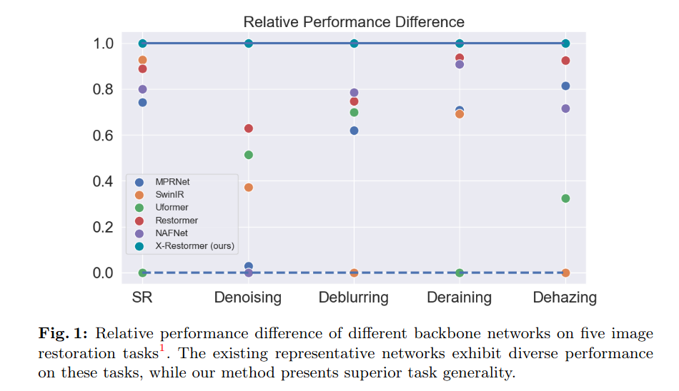
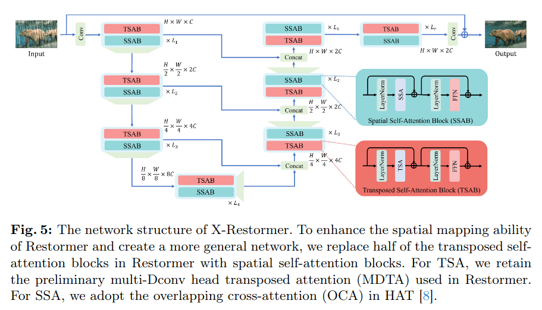
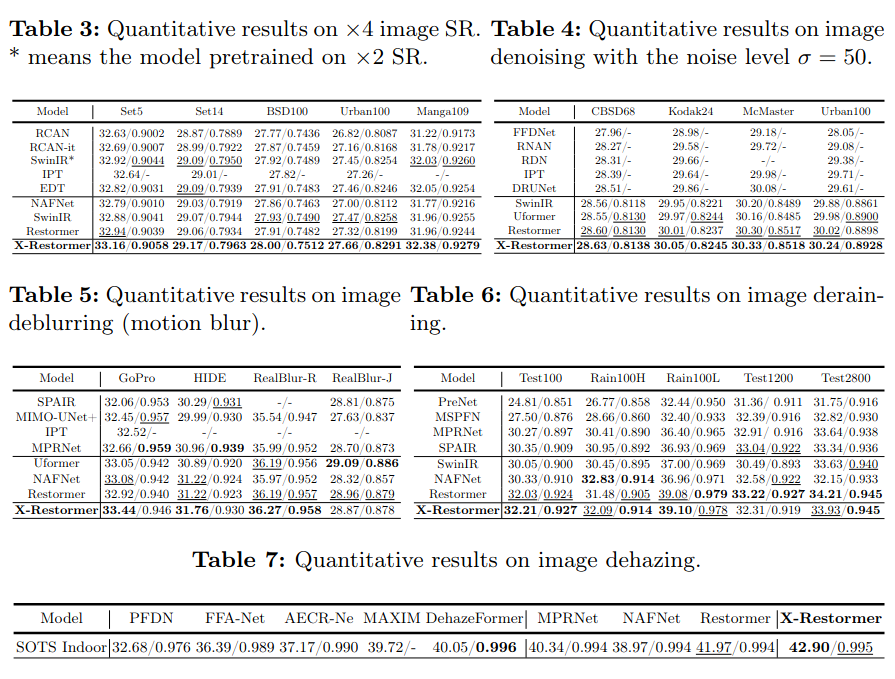

Daily Paper 001
今天是每日一篇论文计划实施的第一天，主要是为了激励自己看论文(论文看得太少了😭).

Title: A Comparative Study of Image Restoration Networks for General Backbone Network Design (ECCV 2024)
code
⭐⭐⭐
## Abstract
文章主要对之前的通用图像修复框架(i.e. MPRNet, NAFNet, SwinIR, Restormer, Uformer)进行了任务通用性分析，指出在某个任务(SR)上表现好的方法在其他任务上表现往往逊色于其他方法。 针对这一问题，文章设计了一种新的通用图像复原Backbone。

## Introduction
首先造成图像复原框架任务表现差异性的主要原因在于，不同的图像修复任务所涉及的退化特征不同。文章选取了image SR, denoising, deblurring, deraining和dehazing五类任务(他们的退化特性各不相同)进行了五种backbone的通用性分析， 这五种backbone又可以分为三类经典的框架，U-Net框架(Uformer, Restormer), 残差框架(SwinIR, NAFNet), 多阶段渐进式框架(MPRNet). 并且还包含了卷积，空间自注意力(spatial self-attention)，转置自注意力(transposed self-attention). 

图中可以看到Restormer在各项任务的表现都较好，因此作者对Restormer的结构优势进行了分析：

Restormer的U-Net架构可以处理大尺寸的输入，对于处理大区域的退化是必要的
Restormer的转置自注意力(transposed self-attention)利用channel-wise feature作为token，实现了channel之间的信息交互和全局感受野的映射
depth-wise conv也激活了网络的空间信息交互能力
而Restormer的缺陷在于其空间映射能力不足，以至于在SR任务上稍逊于SwinIR。作者也对其进行了分析，认为这种不足来自于UNet架构自身的对于细节重建的缺陷以及depth-wise conv相对于空间自注意力的较弱的空间映射能力。

因此一个很好的方法是在Restormer中加入空间自注意力，用HAT中的overlapping cross-attention blocks替换一半的transposed self-attention.

(其实感觉文章的创新性并不高，无非又是缝合模块, 主要还是得把文章的故事讲好！！！！) 🧐

## Related Work
related work就先不放在这里了，占篇幅，hhhhh。主要是介绍了图像复原网络领域内之前的工作，然后另外用了一节解释了文章的方法更侧重于不同领域的通用性设计，与其他方法不同。

## Benchmark
这里首先分析了上文中提到的五类图像复原任务的退化模型，包括：

这种退化模型与局部信息是高度相关的，并且高频信息大量丢失。因此SR网络强调强大的空间信息交互能力，以重建尽可能多的细节。

对于去噪来说，U-Net架构的降采样和上采样过程本质上是有助于去噪的。对于高频细节的重建则仍需要依靠强大的空间信息交互能力。

与高斯噪声的不同之处在于，雨线并非均匀分布在图像上，复杂的雨水条纹对网络的复杂性有一定的要求。

## Network Design

从上面的分析可以看到，综合不同的图像复原任务，全局信息和强大的空间信息交互能力是决定网络性能的关键。Restormer网络由于U-Net架构的降采样-上采样操作，能够非常方便地获取大范围甚至全局的信息，但是depth-wise卷积的空间信息交互能力较弱，因此文章提出用空间自注意力卷积替换，从而提升性能。

## Expirements

文章在五类任务以及ALL-in-one restoration上与之前方法进行了对比，确实是有明显提升的。  

## Conclusion
网络实际上的工作只是进行了一些缝合，创新性并不是很高。但是文章对于之前工作的优势与劣势的分析我觉得是非常到位的，也给了我很多启发。
